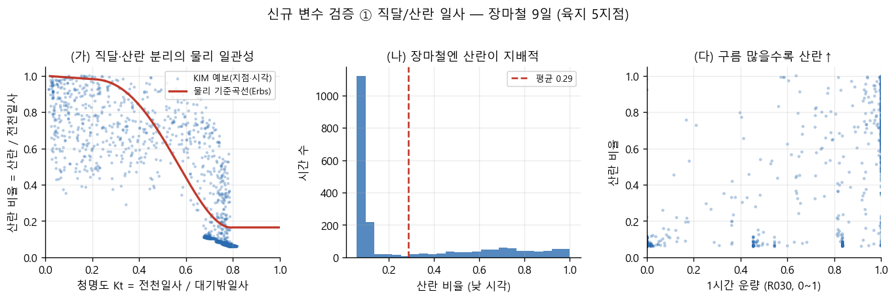
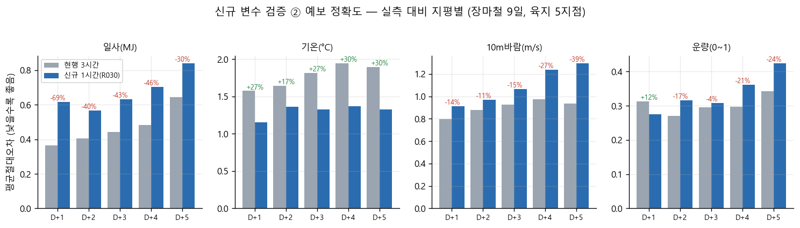
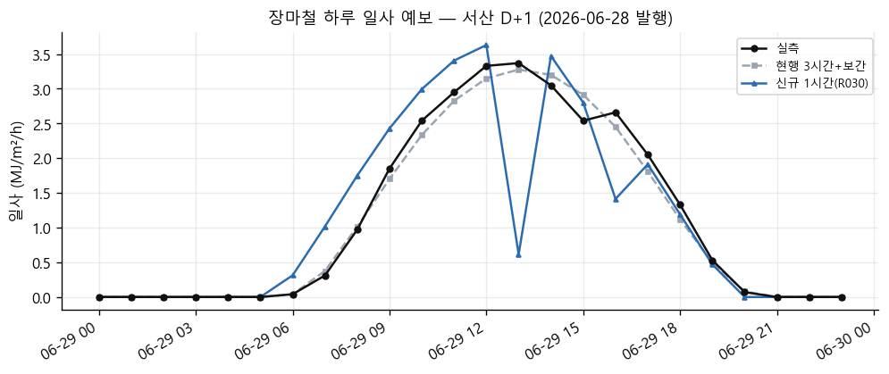
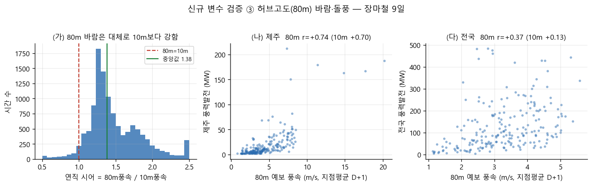
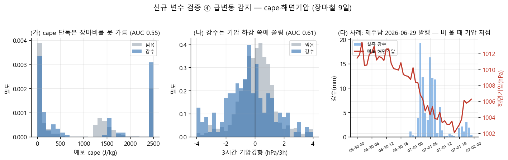

# REPORT 05 — 신규 기상(kma_new) 예비 EDA (장마철 9일)

> 작성 2026-07-05 · 초점 = 신재생(태양광·풍력) + 급변동 감지(가스·전선)
> 재현 코드 = `new_kma/eda/`(eda_lib.py + a1~a4), 그림 = `new_kma/eda/figs/`
> ★규율: 이건 **예비(pilot) EDA**다. 표본이 장마철 9~10 발행일(06-25~07-04)뿐이라
> **계절 일반화는 불가**하고, 게이트(G-9) 판정은 백필 후로 미룬다. 여기서 확정하는 건
> "신규 변수가 물리적으로 실제인가 / 어디에 쓸만한가"까지다. 피처 최종 확정은 사용자와(§0.6.2).

## 0. 배경과 관점

07-01 KMA 개편 대응으로 만든 v2 수집이 신규 변수를 격리 DB에 쌓아두었다: **직달/산란 일사 분리,
1시간 운량, 허브고도(80m) 바람·돌풍, 대류지수(cape/cinn/경계층높이), 해면기압·대기상단일사**.
표본이 하필 장마철이라 예측이 가장 어려운 조건인데, **바로 그래서** 이 조건에서도 신규 변수가
물리적으로 맞물리고 실제 발전과 잘 대응한다면 신뢰도를 올릴 근거가 된다 — 이 관점으로 본다.

**표본 한계(정직):** 9~10 발행일, 전부 장마철. 계절 일반화 불가. 1시간 운량(frcc)은 43% 결측
(07-05 수집 중단분). 급변동 검증은 강수 시각이 7%뿐이라 이벤트 수가 적다. → 아래 판정은 전부
"장마철 예비 신호"이며, 반대 방향이 나와도 계절이 바뀌면 달라질 수 있다.

## 1. 태양광 ① — 직달/산란 분리는 물리적으로 실제 정보다  (강한 긍정)

- **합 정합**: 전천일사 = 직달 + 산란 이 전 지점·전 시각에서 성립(최대 잔차 0.0001 MJ = 반올림 한계).
- **물리 일관성**: 산란 비율이 청명도(Kt)와 강하게 역상관(r = **−0.85**), 물리 기준곡선(Erbs)을 따라간다.
  즉 KIM이 내놓는 직달/산란 값은 자기 일사·태양기하와 물리적으로 맞물린 **실제 정보**지 잡음이 아니다.
- **장마철 산란 지배**: 낮 시각의 27%가 산란 우세(비율>0.5), 구름 많을수록 산란↑(r = +0.79). 현행은 전천일사
  하나만 쓰는데, 흐린 하늘의 **산란광 정보를 통째로 버리고 있다** — 태양광 모델에 얹을 여지가 분명하다.

## 2. 태양광·수요 ② — 예보 정확도는 변수마다 갈린다  (정직·혼합)

 

같은 9 발행일에서 **R030 1시간(신규)** vs **NE57 3시간+보간(현행)** 을 실측 대비 지평별로(D+n 전 시각) 비교:

| 변수 | D+1~5 판정 | 해석 |
|---|---|---|
| **기온** | 신규 **+17~30% 우세** (전 지평) | 3km 지형 해상도 효과. 원주 한랭 bias 해소. **수요·급변동에 확실한 이득** |
| 일사 | 신규 **−30~69% 열세** | R030가 장마 흐린 날 **과대예측 bias**. 값 그대로는 태양광 입력에 오히려 위험 |
| 10m 바람 | 신규 **−10~39% 열세** | R030 과대 bias. 값 그대로는 풍력 입력에 주의 |
| 운량(1h frcc) | 혼조(D+1 +12%, 이후 열세) | 표본 43% 결측·부분 수집이라 판단 보류 |

- 일변화 추적(오른쪽): 1시간 해상도가 곡선 모양은 잘 잡지만, 한낮에 **가짜 스파이크**(순간 급락)를 내기도 한다 —
  밀도의 양날. **핵심: 1시간·직달산란의 "구조"는 쓸모 있으나, 일사·바람의 "절대값"은 편향 보정 없이 쓰면 안 된다.**

## 3. 풍력 ③ — 허브고도(80m) 바람은 실제 발전과 더 잘 맞는다  (강한 긍정)

- **연직 시어 타당**: 80m 풍속이 10m보다 강한 시각이 96%(중앙값 비 1.38), 돌풍은 80m 평균을 68%에서 상회 — 물리적.
- **발전 대응력이 더 높다**: D+1 지점평균 예보풍속과 실제 풍력발전의 상관
  - 제주: 10m r=+0.70 → **80m r=+0.74 → 돌풍 r=+0.77**
  - 전국: 10m r=+0.13 → **80m r=+0.37 → 돌풍 r=+0.49** (10m는 지표 마찰로 거의 무의미, 80m가 크게 개선)
- 발전기 날개가 도는 높이(≈80~100m)에 가까운 바람이라 당연하지만, **데이터로 확인**됐다. 돌풍이 80m보다도
  발전과 더 잘 맞는 건, 장마철 순간 강풍이 이용률에 반영된다는 뜻으로 보인다(표본 작음, 추적 대상).

## 4. 급변동 ④ — cape 단독은 약하고, 기압경향이 전선성 강수를 잡는다  (정직·설계 확인)

- **cape 단독은 장마비를 못 가른다**(강수 분류 AUC 0.55, 강수 시각 cape가 오히려 약간 낮음). 이유는 명확하다 —
  **장마 강수는 대부분 전선성(비대류)** 이라 대류 에너지(cape)가 높지 않다.
- **해면기압 경향이 더 낫다**: 3시간 기압하강(−1hPa↓) 시 강수확률 26% vs 안정 시 10%, 분류 AUC 0.62.
  사례(제주남 06-29 발행)에서 07-01 강수 폭발이 예보 기압 저점(1012→1002hPa)과 정확히 겹친다 — **전선 통과를 예보 기압이 포착**.
- **결론이 곧 설계 검증**: 07-05에 사용자가 급변동 세트를 cape 단독이 아니라 **cape+cinn+기압경향+운량**의
  상보 조합으로 고른 판단이 옳았다. 장마철엔 대류(cape)보다 전선(기압)이 주도하므로 둘을 함께 봐야 한다.

## 5. 종합 판정 (장마철 예비)

| 신규 변수 | 예비 판정 | 다음 활용 방향 |
|---|---|---|
| 직달/산란 일사 | ★ 물리적으로 실제 정보, 산란 정보는 현행이 버리는 중 | 태양광(3·6단계) 입력 후보 — 단 절대값 편향 보정 병행 |
| 80m 바람·돌풍 | ★ 발전 대응력 10m보다 뚜렷이 높음 | 풍력(3·6단계) 입력 후보 — 우선순위 높음 |
| R030 1시간 기온 | ★ 전 지평 우세 | 수요(5단계)·급변동 입력 이득 |
| R030 1시간 일사·바람 절대값 | △ 장마철 과대 bias | 편향 보정 or 재훈련 전제, raw 직접 사용 주의 |
| 해면기압 경향 | ○ 전선성 강수 신호 유효(제주) | 급변동 감지 보조. 육지 mslp는 미수집(확장 필요) |
| cape/cinn | △ 장마철 단독 약함(대류성일 때 유효 추정) | 여름 소나기철에 재평가. 단독보다 세트로 |
| 1시간 운량(frcc) | ? 표본 부족(43% 결측) | 판단 보류 |

**한 줄:** 신규 변수의 **구조·물리·발전 대응력은 장마철에도 실제로 확인**됐다(직달/산란·80m 바람·기온이 강한 긍정).
반면 일사·바람의 **절대값은 계통적 과대 bias**가 있어 그대로 쓰면 안 되고 보정이 전제다. 이 정직한 그림 자체가
"우리는 좋게만 보지 않는다"는 신뢰도 근거다.

## 5-보강. 일사 "D+1 69% 열세"의 정체 — 정밀 검증 (b1·b2)

사용자 의심("D+1 69%가 믿기지 않는다")에 따라 재검증. 결론: **숫자는 실측으로 사실이나, 정체는
보정 가능한 "한낮 계통 과대편향"이지 R030가 근본적으로 나쁜 게 아니다.**

- **편향이 원인**: v2 편향 **+0.34 MJ**(70% 시각 과대), 현행은 거의 무편향(+0.02). 오차는 **오전~한낮(9~13시)에 집중**
  (편향 최고 +0.78 @9~11시). 대부분(407/467)이 맑은 편 날인데도 과대 → 흐린 날만의 문제가 아니라 **전반적 밝기 편향**.
- **9일 연속 시계열**(그림 `b2_timeseries_9day.png`): 신규(파랑)가 실측(검정) 위에 일관되게 얹히고, 흐렸던 07-02~04엔 크게 과대.
  1시간 특유의 **한낮 가짜 스파이크**도 눈에 보임.
- **보정 가능성**(그림 `b2_bias_correction.png`): 시각대별 편향만 빼면 **MAE 0.615 → 0.442**(현행 0.364에 근접).
  즉 "69% 열세"의 2/3가 계통 편향 → 후처리로 흡수 가능.
- **순시 vs 누적**(b1): 실측은 시간 누적인데 신규는 순시값이라 미세 위상차 존재(−1h 이동 시 0.615→0.518,
  누적 사다리꼴 근사 시 0.615→**0.524**). **다만 편향은 거의 안 줄어듦**(+0.343→+0.336) — 위상은 무작위오차만,
  편향은 밝기 자체. 정오(12~14시) 순시 평균 3.13 vs 실측 2.83(+0.30).
- **관측 자료 결함 발견**: 일부 실측 일사에 한낮 0 값(예 영광 06-27) — 관측 결함일 가능성. 절대 MAE를 부풀릴 수 있어
  검증 시 실측 품질 필터 필요(신구 상대비교에는 영향 작음).

### 일사 소스 구조 (사용자 질문 정리)
- **R030(지역 3km) GHI = SWDDIR2(수평면 직달) + SWDDIF2(산란)**. SWDDNI2(법선면 직달=DNI)는 **미사용**
  (연구 때 물리검증용). 코드 = `api_fetchers_kim2.derive_r030_categories`.
- **NE57(전구 8km) GHI = dswrsfc**(지표 하향단파 총량, 단일 진단). NE57엔 성분(직달/산란) 자체가 없음.
- → 두 일사는 **출처가 다른 양**: 성분 재구성(R030) vs 단일 총량(NE57), 게다가 3km vs 8km **별개 모델**(구름·복사 스킴 상이).
  이 차이가 한낮 편향의 유력한 원인.
- **`GHI = SWDDNI2·cos(θz) + SWDDIF2` 는 현행식과 수학적으로 동일**(연구서 REPORT_02 §6에서 SWDDIR2 = SWDDNI2·cosθz,
  비율 1.00 검증 완료). 따라서 이 재구성만으론 편향이 바뀌지 않음(정오에 두 식 동일한데 편향은 거기서 최대).
- **연구 가치 있는 것**: ① **ACSWDNB(누적 총 일사) vs 성분합** — 누적이 실측(시간누적)과 단위·정의 일치.
  ② 소스별 **편향/스케일 보정**(가장 확실). ③ **하이브리드**: R030의 직달/산란 "구조"(물리 일관, §1)는 쓰고 크기는 교정.

### ★ ACSWDNB 로컬 검증 결과 (c1·c2·c3, 새 콜 126개 — probe_lib 예비키)
사용자 가설("실측이 시간누적이니 ACSWDNB가 순시합보다 맞을 것") 로컬 검증. **가설 성립(다일 확인).**
- **캐시(L010, 새 콜 0)**: 서산 07-04 MAE 0.580→**0.450(−22%)**, 제주남 1.152→**0.978(−15%)**.
- **★R030 다일 탐침(서산 D+1, 9일 06-26~07-04, 112콜)**: 순시 0.565 → ACSWDNB **0.441 (−22%)**, 편향도 +0.32→**+0.20** 감소.
  **7/9일 개선**(일부 +48~68%), 단 06-30 은 −53%(보편적 승리는 아님). **서빙 창 모델(R030)에서 다일로 성립.**
  누적이 ①오전 램프 과대 ②한낮 1시간 가짜 급락(예 11시 순시 1.91 급락 → 누적 3.10, 실측 2.93)을 정통으로 잡음.
- **정직한 한계**: MAE 22% 개선하나 **한낮 밑바탕 밝기 편향(+0.2~0.5)은 누적으로도 일부 남음** → ACSWDNB + 잔여 보정이 완성.
  실측이 07-04 까지라 D+2~5 지평은 아직 검증 불가(지점도 서산 중심). 계절·다지점 확장은 백필 후.
- **생산 반영(가벼움)**: R030 일사 총량을 순시 SWDDIR2+SWDDIF2 → **ACSWDNB 시간차분**으로 교체(수집기 이미 누적-diff 패턴 보유,
  rainc_acc 와 동일). 직달/산란 분리는 그대로 유지(물리 구조용). L010(D+2)이 아니라 **R030(D+5)** 로 서빙 창 전체 커버.

## 5-보강2. 데이터 위계 확정 + L010 도입 판단 (c4)

사용자 제안 위계(NE57 근본·R030 2순위·L010 조건부)를 데이터로 검증. **위계 타당, L010은 반려.**

D+1~2, 육지 5지점, 실측 대비 MAE (L010 vs R030 vs NE57):

| 변수 | NE57 8km | R030 3km | L010 1.3km | L010 vs R030 |
|---|---|---|---|---|
| 일사 D+1 | **0.364** | 0.615 | 0.624 | −1.5% (열세) |
| 일사 D+2 | **0.405** | 0.567 | 0.588 | −3.6% (열세) |
| 기온 D+1 | 1.574 | **1.150** | 1.169 | −1.6% |
| 기온 D+2 | 1.629 | 1.364 | **1.297** | +4.9% |
| 10m바람 D+1 | **0.797** | 0.912 | 0.874 | +4.1% |
| 10m바람 D+2 | **0.881** | 0.969 | 0.938 | +3.2% |

- **NE57 = 일사 절대값·10m바람 현재 최우수** — 근본·폴백으로서 견고. R030/L010 일사는 과대(ACSWDNB·보정 전 열세).
- **R030/L010 = 기온 우수**(3km·1.3km 지형해상도). 둘은 사실상 동급.
- **★L010 반려**: R030 대비 전 항목 **±5% 이내**(일사는 오히려 열세, 바람만 +3~4%). 결정적 우위 없이 D+2 만 커버 + 콜 +384/base.
  사용자 기준("큰 차이 없으면 반려") 그대로. 재검토 시점 = 겨울/눈·해안 급변 등 국지현상 표본이 쌓였을 때.

## 7. 데이터 위계 결론 (사용자 제안 + EDA 검증)

1. **NE57(전구 8km, 3h, D+1~12) = 근본·폴백.** 유일하게 전 지평 완결, 일사 절대값·10m바람 현재 최정확, 07-01 붕괴에도 생존.
   다른 소스가 망가져도 이걸로 모델 구동 가능 — 백본으로 유지.
2. **R030(지역 3km, 1h, D+1~5) = 2순위, "구조·피처" 담당.** 채택 근거가 분명한 것 = 기온(전 지평 우수)·직달/산란 분리(물리 일관)
   ·80m 허브바람(발전 상관 우수)·cape·1h 해상도. **단 일사·바람 절대값은 ACSWDNB/편향보정 전제**(§5-보강). 크기는 NE57 기준으로 교정.
3. **L010(국지 1.3km, D+1~2) = 반려(보류).** R030 대비 정밀도 이득이 오차범위(±5%)이고 창이 짧다. 도입 보류, 국지현상 표본 축적 후 재검토.

**EDA 마무리 상태**: 신재생(직달/산란·80m바람) + 급변동(cape·기압경향) 특성·물리·정확도 검증 완료. 일사 편향의 정체(ACSWDNB) 규명·다일 검증 완료.
남은 것은 (a) 피처 최종 확정(사용자, §0.6.2) (b) 백필로 계절 확장·D+2~5 검증 (c) ACSWDNB+편향보정 생산 반영. §6 참조.

## 6. 남은 일 (사용자 결정 대기)

1. **피처 확정**(§0.6.2): 위 후보 중 무엇을 어느 단계 입력으로 채택할지 — 사용자와 확정 후에만 재훈련.
2. **계절 확장**: 지금은 장마철뿐. `REPORT_04` 백필(전체 A 5밤 / lean B 2~3밤)로 봄~여름을 채우면
   위 판정을 계절 교차로 재검증(G-9). 특히 일사·바람 bias의 계절성, cape의 여름 소나기철 유효성.
3. **편향 보정 실험**: 일사·바람 R030 과대 bias를 소스별 후처리로 흡수 가능한지(계절 표본 축적 후).
4. **육지 해면기압**: 급변동 감지를 전국으로 넓히려면 육지 mslp 수집 추가(NE57 psl은 이미 콜에 포함 — 컬럼화만).
