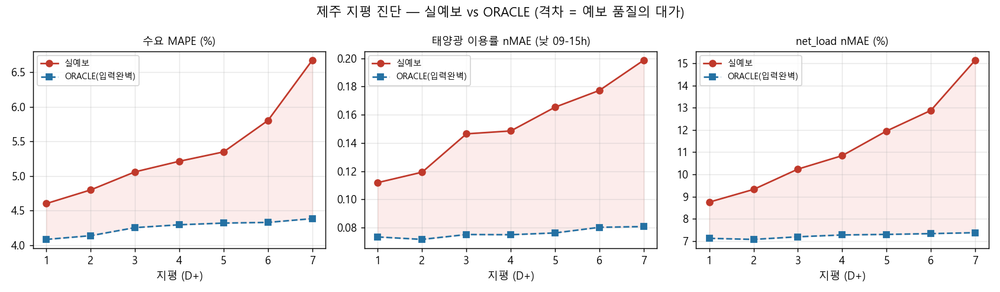
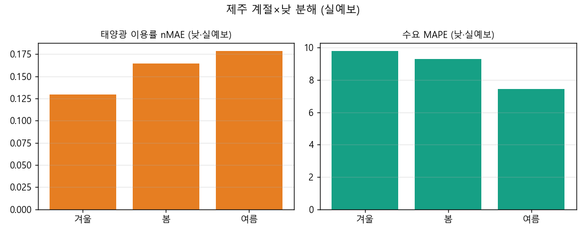

# 제주 지평 진단 — 실예보 vs ORACLE (2단계 수요 · 3단계 신재생→net_load)

> 산출: `build_horizon_backtest_jeju.py`(→`horizon_backtest_jeju.parquet`, 178 base·58,745행),
> `diagnose_horizon_jeju.py`(→`tab/diag_by_horizon_jeju.csv`·`tab/diag_by_season_jeju.csv`,
> `fig/diag_by_horizon_jeju.png`·`fig/diag_season_jeju.png`).
> 대상: 제주 2(수요)→3(신재생→net_load) 체인. 구간 2025-12-20 ~ 2026-06-21(forecast_horizon 보유 범위).
> 육지 `7. land_gas_forecaster/training/REPORT_horizon_diagnosis.md`(G-16)의 제주판.

## 1. 왜 다시 쟀나

제주를 새 DB 구조(`forecast_horizon`=기상 아카이브 / `est_horizon_jeju`=서빙결과 / `forecast` 폐기)로
옮기기 전에, 현행 2·3단계 모델을 base 별 **실제 지평 예보**로 처음 정직하게 재측정했다. 육지에서
드러난 것과 같은 사고 — 과거 검증의 (월,시) 기후값 프록시가 가렸던 지평 열화를 실예보로 드러낸다.

**하드 규칙(육지와 동일)**: 예보가 진짜 없는 시각은 기후값으로 채우지 않고 평가에서 뺀다(≤4h
시간 보간만 허용). 모델은 전부 현행 그대로(재학습 없음, 정직 측정만).
**day_type 은 공휴일 달력(`postprocess.add_day_type`, 대체공휴일 포함)으로 부여**(요일 단독 폴백 아님).

**전제 — 태양광 west 일사 갭 복구 완료**: 진단 착수 시, 3단계 태양광 모델이 필수로 쓰는
`solar_rad_west` 예보가 `forecast_horizon`에 없었다(제주 KIMG 일사 예보가 `radiation_south` 단일
지점뿐, 라이브 `forecast`의 `radiation_west`는 stale 레거시). 사용자가 `radiation_west`(+east)를
180 base 전체에 재수집·적재해 갭을 닫은 뒤 측정했다. = forecast 폐기 후에도 새 서빙이 태양광을
돌릴 수 있음을 동시에 확보.

## 2. 결과 (지평별, 실예보 vs ORACLE)

| 지평 | 수요 MAPE | 수요 낮(09-15) | 수요 bias | 태양광 nMAE(낮) | 풍력 nMAE | net_load nMAE |
|---|---|---|---|---|---|---|
| **실예보** D+1 | 4.60% | 7.88% | +0.88% | 0.112 | 0.125 | 8.75% |
| D+3 | 5.06% | 8.73% | +0.93% | 0.146 | 0.147 | 10.24% |
| D+5 | 5.35% | 9.45% | +0.79% | 0.166 | 0.156 | 11.95% |
| D+7 | 6.67% | 11.60% | +0.77% | 0.199 | 0.181 | 15.14% |
| **ORACLE** D+1 | 4.08% | 6.59% | +0.65% | 0.073 | 0.087 | 7.12% |
| D+7 | 4.38% | 7.22% | +0.64% | 0.081 | 0.087 | 7.38% |

(ORACLE = 실측 기상 입력을 같은 모델에 넣은 상한. net_load nMAE = MAE / 평균 실측수요 — 제주
net_load 는 한낮 0 부근까지 가 MAPE 분모가 불안정해 정규화 MAE 로 본다.)

## 3. 핵심 발견

1. **ORACLE 바닥선은 평평하고 양호하다.** 입력이 완벽하면 수요 ~4.1%·태양광 nMAE ~0.07·net_load
   nMAE ~7.2% 가 지평 무관하게 유지된다. = **모델 자체는 좋고**, 줄일 수 없는 바닥선이다.

2. **남는 오차 = 예보 품질, 특히 태양광.** 실예보−ORACLE 격차가 지평 따라 벌어진다(부채꼴). 가장
   크게 벌어지는 건 **태양광 이용률 nMAE(낮)**: 0.073(바닥) → 실예보 0.112(D+1)·0.199(D+7).
   제주는 신재생 고침투라 이 태양광 예보오차가 net_load 로 증폭된다(net_load nMAE 7%→15%).
   = 3단계 기존 결론("흐린날 과대는 모델 탓이 아니라 forecast 기상 오차, 모델 교체로 해소 안 됨")을
   실예보로 **정량 확인**.

3. **수요는 bias 가 거의 0(+0.5~1%)이고 견고하다.** 육지가 겪은 수요 양bias(+1.3~3.4%)가 제주엔
   없다. 제주 2-A 는 cap_btmppa·구름·비대칭 quantile·흐린날 피처를 **이미** 갖춰(=육지 v2 가 역수입한
   원본) 더 손볼 여지가 작다. 실예보 D+1 4.60% 도 이미 양호.

4. **싸움터는 낮.** 계절×낮밤: 수요 낮 MAPE 겨울 9.8%·봄 9.3%·여름 7.5% vs 밤 3~4%(낮이 밤의
   2.5배). 태양광 nMAE(낮)도 봄 0.165·여름 0.178 로 전이·여름철에 더 나쁨(변동성 큰 구름).
   풍력 nMAE 는 계절성 약하고(0.11~0.16) 지평 의존도 작다.

## 4. 재설계 ROI 판단 (다음 게이트 입력)

- **수요(2단계) 모델 재설계 ROI = 낮음.** 바닥선 양호·bias ~0·v2 피처 이미 보유. 육지 v2 가 제주
  2-A 를 따라온 것이라 제주엔 추가할 레버가 거의 없다. 남는 낮 오차는 태양광 예보에 묶여(비가역)
  모델로 못 줄인다.
- **신재생(3단계) 재설계 ROI = 제한적.** ORACLE 바닥선이 좋고(0.07) 열화는 예보 cloud/radiation
  스킬에서 온다(육지 동일 결론). 모델 교체로는 거의 못 줄인다. 단, 예보가용 입력 정합(west 일사
  갭은 닫음)과 흐린날 강건성은 점검 여지.
- **따라서 이 단계의 실질 작업 = 모델 수술이 아니라 새 DB 구조로의 서빙 전환**이다:
  `serve_chain_jeju_new`(2→3, 기상=forecast_horizon·day_type=공휴일달력·결과=`est_horizon_jeju`) +
  `forecast` 테이블 폐기. = 육지 `serve_chain_land_new`→`est_horizon_land` 대칭. SMP(4)는 이번 제외.

## 5b. 강건성 점검 — 풍력 (2026-06-17, D+1 8% 목표)

- **풍력은 모델 천장 근처라 D+1 8%는 비현실적.** "겨울 모델 헤드룸"은 착시였다: 겨울 변동계수(CV
  0.73)가 가장 낮아(상대적으로 가장 잘 맞음) 절대 nMAE 가 큰 건 겨울이 바람이 세 이용률 자체가
  큰 탓. 출력제어(고풍속>10m/s & 이용률<0.2)는 3~7%로 작고 봄·가을에 더 많다. 풍속(1m/s bin)
  설명 후 잔차 절대평균 0.105 ≈ ORACLE nMAE → 모델이 이미 풍속 설명 천장에 근접.
- **east 풍향 추가 실험 → 미채택(forecast 기준 악화).** 현장 풍력단지 west55%/east45%라 east 풍향
  (`wd_sin/cos_east`)을 1회 추가(`exp_wind_east_dir.py`). ORACLE(실측) test 계절 nMAE 개선
  (겨울 0.101→0.094·val 0.085→0.080, 과적합 신호 없음)이었으나 **forecast 백테스트에서 악화
  (wind D+1 0.125→0.135)**. west/east 풍향이 거의 중복이라 east 는 예보오차만 더했다. **제주 하드
  교훈("실측기상 성능 ≠ 예보 성능, 채택은 forecast 기준")이 그대로 재현** → west 단독 유지.

## 5c. 강건성 점검 — 태양광 + 피처 확정 + 야간 마스크 (2026-06-17)

- **후처리 헤드룸 없음.** 서빙 시점에 쓸 수 있는 신호(예측 이용률 bin·예보 구름 bin) 기준으로
  bias 가 거의 평평(±0.02)해 모델은 이미 잘 보정돼 있다. "흐림 과대·맑음 과소"는 **실측 이용률**
  기준이라 서빙 시 교정 불가(예보가 양극단을 못 잡는 분산). → 태양광 D+1 8% 는 후처리로 도달 불가.
- **피처 확정(사용자, LGBM 모델 한정 — PatchTST 미재학습)**: solar_damping·clearsky_ratio 는
  south 단독(west 제거), wind_zone 은 east 단독(west 제거). forecast 백테스트에서 **중립**(태양광
  낮 nMAE 0.102 불변 = PatchTST 주력 불변·LGBM 폴백 14%만 / 풍력 0.125→0.127 = 노이즈). 단순화 채택.
- **★야간 0 마스크(pvlib).** 태양광이 밤·해질녘에 가짜 이용률을 흘리는 것을 확인(겨울 18h ~0.15,
  밤 발전량 최대 92MW, 코드에 야간 마스크 전무). **pvlib 태양 고도 < 5° 면 강제 0**으로 차단
  (`serve_solarwind_hybrid._daylight_mask`, 제주 33.38N/126.55E, KST). 결과: 밤 20–05h est_solar
  **정확히 0**(최대 92MW→0), 여름 18–19h 실제 일조는 보존, net_load D+7 nMAE 15.13→14.62%.
  `_predict_day` 에 넣어 백테스트·새 서빙이 자동 적용(레거시 D+1 단일 경로는 폐기 대상이라 미적용).

## 5d. 풍력 "하루 오차 70%" 재점검 — 지표 착시 확인, 재학습 보류 (2026-06-23)

사용자가 "풍력 하루 오차가 70%를 넘어 재학습이 필요해 보인다"고 제기. `horizon_backtest_jeju.parquet`
(실예보 178 base)로 **같은 절대오차를 분모만 바꿔** 재계산한 결과, 70%는 모델 실패가 아니라
**변동성 큰 풍력에 MAPE를 적용한 분모 착시**임을 확인했다.

**① 같은 D+1 풍력 오차, 지표별 값**

| 지표(분모) | 값 |
|---|---|
| 설비용량 정규화 **nMAE**(보고서·streamlit 정본) | **12.7%** |
| 평균발전량 정규화 nMAE | 46.1% |
| **일일 총발전량 MAPE**(= 사용자가 본 값) | **68.8%** ≈ 70% |
| 시간별 MAPE | 145.3% |

제주 풍력은 설비 ~364MW인데 평균 99.5MW(설비의 27%)만 발전하고 **시간의 33%가 설비 10% 미만**.
같은 MW 오차를 작고 변동성 큰 실측발전량으로 나누면 MAPE가 폭발 — 간헐성 신재생의 고질적 MAPE
아티팩트라 이 프로젝트·업계가 풍력엔 nMAE(설비 정규화)를 쓴다. (일일 총량 MAPE는 D+7에 123%까지.)

**② 재학습으로 못 고치는 이유 — 모델은 이미 천장**

| 지평 | 실예보 nMAE | ORACLE(실측기상=모델상한) | 격차=예보품질 |
|---|---|---|---|
| D+1 | 12.7% | **8.9%** | 3.8%p |
| D+7 | 18.1% | **8.8%** | 9.3%p |

- ORACLE(완벽 입력)은 전 지평 **8.8~8.9%로 평평** → 모델 자체는 지평에 따라 안 나빠진다. 열화는
  전부 입력 예보 탓.
- 그 8.8%조차 물리 바닥 근처: **실측 풍속 1m/s 구간 안에서도 이용률 표준편차 11.6%p**(10m 풍속이
  같아도 난류·풍향·공기밀도·전단·출력제어로 발전량 산포). 풍속만으론 못 줄이는 본질 분산.
- 진짜 병목 = **입력 예보 풍속**: KMA 예보 풍속 MAE D+1 2.45 → D+7 3.18 m/s(실측 평균 7.2 대비
  ~34%), D+7엔 −0.83 m/s 음의 편향. → 출력 모델(wind_util LGBM) 재학습으론 못 건드림.
- east 풍향 추가 재학습은 직전(5b)에 시도→forecast 기준 악화로 기각(재시도 금지).

**③ 결정(사용자, 2026-06-23) = 지표 재정의·수용(재학습 안 함).** 풍력 평가는 설비 정규화 nMAE를
정본으로(streamlit 이미 적용·캡션에 70% 착시 명시 보강). **유일한 실효 레버는 출력 모델 재학습이
아니라 입력 예보 풍속 보정**(특히 장지평 음의 편향)이며, 이는 성격이 다른 별도 과제로 남겨둔다.
재현 스크립트: 스크래치 `wind_metric_probe.py`·`wind_ceiling_probe.py`(parquet 기반, 일회성).

## 5. 한계·메모

- 평가 구간이 forecast_horizon 보유 범위(겨울~초여름)뿐 — 가을 없음·여름은 6월만(표본 작음).
- ORACLE 은 tcog 후처리 미적용(실측 기상엔 tcog 없음). 후처리 기여는 작아 바닥선 해석에 무해.
- 태양광 west 일사는 **이번 재수집분(앞으로 발행 base)부터** 정상. 과거 base 도 사용자가 전 구간
  재적재해 갭 없음(180 base 완전).
- net_load 는 우리 수요 예측으로 재계산(dem_pred − solar_gen − wind_gen) — 육지와 동일.
