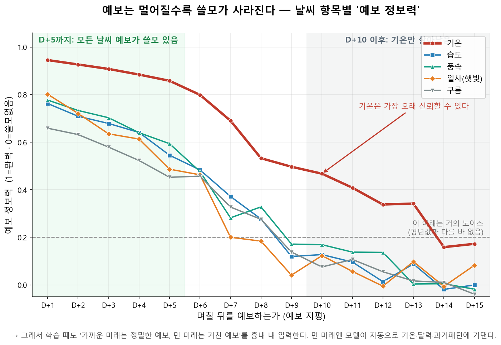

# 5-B 보고서 — 전국 수요 Cross-Attention PatchTST 전환 탐색 (2026-06-17)

> 배경: 5단계 수요는 조금의 오차가 수GW로 번지는 가장 중요한 단계라, 구조를 LGBM(5-A_v2) →
> **Cross-Attention PatchTST + RevIN**(제주3·6단계 solar 구조)로 바꿀 수 있는지 검증. 결론부터:
> **LGBM v2를 백본으로 유지**하되 **낮(09–15h)×D+1~5 구간만 PatchTST로 오버라이드**하는 하이브리드가
> 최적(전체 4.495→4.399%, 낮 7.92→7.59%). 순수 PatchTST 전면 교체는 honest에서 LGBM에 짐.

## 0. 사전 진단 (5-0b, EDA 게이트)
- 타깃 표현: raw MW는 연 표류·큰 스케일로 NN 비친화 → **RevIN**(인스턴스 정규화) 채택. rec168 비율과
  동등하나 앵커-free·지평무관이라 RevIN 선택. (train↔test 겹침은 표현 무관 ~0.91 = 외삽 위험 아님)
- context length **seq_len=336**(2주): ACF 주배수 피크·PACF가 일블록+주간메아리 2회까지 → 적정(504는 ablation).
- 명시 lag/rec 피처 제거: 트랜스포머 past_y 윈도우가 자기상관 흡수.
- 산출 `eda/5-0b_representation.ipynb`·`eda/REPORT_5-0b.md`.

## 1. 구조·입력 (5-0b 확정)
- Cross-Attention Patch-Weather(solar 동형) + 타깃 RevIN(학습가능 affine). direct **D+1..D+15 15모델**.
- 입력(미래채널) = v2 지점선택 기상(기온5·일사 서산영광·풍속 대관령포항·구름 서산영광) + cap_btmppa +
  달력(hour/doy sin·cos) + day_type(is_weekend/is_holiday). 과거채널 = 위 + 과거수요(past_y).
- T4: AMP + batch 256. 학습 노트북 `_gen_landdemand_patchtst.py`(15모델)·`_gen_landdemand_patchtst360.py`(단발).

## 2. perfect 상한 (test 2026, 실측 기상 투입)
15모델 PatchTST가 perfect에선 LGBM v2를 전 지평 압도(D+1 2.43 vs 3.48, D+12 4.33 vs 4.59). **그러나
perfect는 상한일 뿐** — 진짜 판정은 honest(forecast_horizon 실예보). (7-D·G-16 교훈)

## 3. honest 5자 비교 (forecast_horizon 2025-12~2026-06, 동일 63,064행)
동일 23:00 origin·동일 forecast 기상(`exp_features.fh_weather`)·inner-join 동일창. 하니스 `_ab_honest.py`.

| 모델 | 전체 MAPE | D+1 | 봄낮 bias | 여름밤 MAPE |
|---|---|---|---|---|
| **LGBM v2 (백본)** | **4.49** | 3.44 | +4.13 | **2.64** |
| PatchTST MSEα1.3 | 5.02 | **2.58** | **+0.03** | 4.18 |
| PatchTST MAEα0 | 4.86 | 2.61 | +1.36 | 4.73 |
| PatchTST MSEα1.0 | 5.02 | 2.75 | −0.44 | 4.25 |
| PatchTST 360 단발 | 5.39 | 3.87 | +4.07 | 6.43 |

**전체로는 LGBM v2가 챔피언.** 어떤 PatchTST 변형도 honest 전체에서 LGBM을 못 이김(7-D 패턴 재현).

## 4. 손실 ablation (15모델 direct, 동일 구조)
- **MAE > MSE (전체 MAPE)**: MAE 4.86 vs MSE 5.02(α1.0·1.3 동일). MAPE 목표면 MAE.
- **MSE+α > MAE (낮 bias 정밀도)**: α가 봄낮 과대를 정밀조정 — **α1.3 → +0.03(최적)**, α1.0 → −0.44(과교정),
  MAE → +1.36. α≈1.2~1.3이 봄낮 bias 0점.
- **트레이드오프**: 순수 정확도=MAE / BTM 듀크커브 낮 bias 제어=MSE+α1.3. 둘 다 못 가짐.
- **단발 360 = 전 손실에서 꼴찌**(구조 실패, 직접 15모델 > 단발). **이전 "RevIN이 봄낮 bias 전부" 추정은
  통제실험으로 반증** — 봄낮 제어는 *직접구조+RevIN(주된 몫, +4.13→+1.36) + α(미세조정 →+0.03)* 합작.

## 5. ★ 낮/밤 분리 — 핵심 발견
honest 전체에서 PatchTST가 D+3부터 진 이유는 **밤이 PatchTST 낮 강점을 덮었기 때문**:

| 낮(09–15h) MAPE | D+1 | D+2 | D+3 | D+4 | D+5 | D+6 |
|---|---|---|---|---|---|---|
| LGBM | 5.87 | 6.07 | 6.25 | 6.47 | 6.69 | 6.72 |
| PatchTST(MAE) | **4.15** | **4.73** | **5.42** | **5.83** | **6.47** | 6.78 |

- **낮: PatchTST가 D+1~5 전부 우위**(D+6부터 호각). 기상이 수요를 끌어 PatchTST 기상모델링이 ~5일까지 유효.
- **밤: D+2+ 전부 LGBM 승**(밤 bias는 ±0~1로 편향 아닌 **정밀도** 문제). 밤 수요=순수 자기회귀라 LGBM
  lag168/336 주간앵커가 압승, PatchTST 기상장치(교차어텐션·bypass)는 밤엔 잡음. 밤이 17/24시간.
- → "PatchTST가 ~5일 유리"는 **낮에 한해 정확히 맞음**.

## 6. 최종 구조 — 낮×지평 하이브리드
| 구성 | 전체 MAPE | 낮 MAPE |
|---|---|---|
| LGBM 단독 | 4.495 | 7.921 |
| 전시간 D+1~2 = PatchTST (1차안) | 4.415 | 7.709 |
| **낮×D+1~5 = PatchTST, 그외 LGBM (최적)** | **4.399** | **7.593** |
| 낮×D+1~7 = PatchTST | 4.403 | 7.605 |

**결론: LGBM v2 백본 + 낮(09–15h)×D+1~5만 PatchTST 오버라이드.** 각 모델을 신호가 있는 자리에만 사용.
- 오버라이드 모델: 정확도 우선=**MAEα0**(전체 4.399) / 가스체인 bias 안전 우선=**MSEα1.3**(봄낮 bias +0.03, 전체 4.420).
- 밤·여름·장지평은 전부 LGBM(자기회귀·예보품질 병목 영역).

## 7. 결정 / 남은 일
- **production = LGBM v2 유지(현행)**. 하이브리드는 **업그레이드 후보**(전체 −0.10%p·낮 −0.33%p·D+1낮 −1.72%p).
  서빙 반영은 별도 결정(serve_land_demand.py에 낮×D+1~5 PatchTST 오버라이드, 무게 5~6개 적재).
- **기각**: PatchTST 전면 교체, 단발 360, MSEα1.0.
- **교훈**: 밤·여름·장지평 = PatchTST 구조적 약점(예보품질 병목, 7-D 재확인). 봄낮 bias = 직접구조+RevIN+α 합작.

## 8. ★최종 — final2 (2026-06-18, 섹션 6 supersede)
피처·정규화 재구성으로 장지평·여름까지 끌어올린 최종판.

**모델(final2)**: Cross-Attention PatchTST + RevIN(타깃) + **전역 z-score(외생)** + **comfort 피처** + **seq_len 504** + **MSE 손실**(LTSF 표준, 평가는 MAPE). 15모델 direct.
- 외생 = temp_c(**4지점**: 원주·서산·포항·영광, 대관령=무인 제외) · **불쾌지수**(temp+습도) · **체감기온**(temp+바람) · solar_rad · total_cloud · cap_btmppa → 전역 표준화.
- 시간피처(달력 sin/cos·is_weekend·is_holiday) = 정규화 제외. lag·wind·humidity·midlow_cloud 제거(불쾌·체감에 흡수, 중요도≈0).
- 서빙 일관: 불쾌지수=reh·체감기온=wind_spd_10m 로 forecast_horizon 에서 동일 재구성(하니스 `_ab_final2_eval.py` 미러).

**honest 결과(forecast_horizon, n=63,064)**:
| 구간 | LGBM | final2 | **하이브(낮=final2·밤=LGBM)** |
|---|---|---|---|
| 전체 | 4.49 | 4.74 | **4.35** |
| 낮 | 7.92 | 7.43 | **7.43** |
| 밤 | 3.08 | 3.63 | **3.08** |
| 봄 | 4.68 | 4.83 | **4.40** |
| 겨울 | 4.45 | 4.66 | **4.41** |
| 여름 | **3.62** | 4.53 | 3.84 |

- **seq504가 장지평 낮을 역전**(낮 우위 D+1~9 → **D+1~12·14**로 확장). 사용자 "10일 이후 개선" 가설 적중.
- **comfort가 여름 파탄 해결**(이전 D+5 여름낮 10.01 → 5.41). 단 여름낮은 아직 LGBM(5.99) 못 넘음(final2 6.75).
- **밤은 끝까지 LGBM**(자기회귀=구조적). final2 단독(4.74)은 LGBM에 짐 → **단독 배포 불가, 하이브리드가 정답.**

**최종 구조**: **낮(09–15h)×D+1~12 = final2 / 그 외(밤·D+13~15·여름낮) = LGBM v2.** honest **4.35**(역대 최고, vs LGBM 4.495·낮 −0.49%p). production=LGBM 백본 유지, final2 낮 오버라이드=업그레이드 후보(서빙 미반영).

**★ 다음 세션 — 예보오차 증강(train-serve 격차 교정)**: 현재 학습=실측 기상이라 "완벽기상" 가정 → 예보 받는 장지평 서빙과 분포 불일치. forecast_horizon(2025-12~)의 지평별 (예보−실측) 오차를 **미래 기상채널에 부트스트랩 주입**해 배포분포로 학습(과거채널은 실측 유지). 직접 예보학습은 6개월뿐이라 과적합 → 증강이 정답. 첫 걸음=지평별 예보 기상오차 RMSE/bias 정량화.

## 9. ★ 예보오차 증강 (2026-06-19, §8 다음 단계 착수)

배경: final2 는 미래 기상채널을 **실측("완벽기상")**으로 학습하지만, 서빙·honest 평가는 `forecast_horizon`
**실예보**(지평별 bias·정보력 붕괴)를 받는다. 이 train↔serve 분포 불일치가 perfect–honest 격차의 근원.
→ 학습 시 미래채널에 **지평별 예보오차를 주입(증강)**해 배포분포로 학습.

### 9-1. 지평별 예보오차 정량화 (EDA 게이트, `_eda_forecast_error.py`·`_eda_forecast_skill.py`)
forecast_horizon 183 base(2025-12-16~2026-06-29, 평가 63,673행)를 서빙 일관(4지점평균·1h 보간 limit3h)
으로 복원해 실측과 대조. 모델 소비 집계채널 기준.

**(예보−실측) bias / RMSE — 지평따라 단조 증가**:
| 채널 | bias 방향 | RMSE D+1→D+15 |
|---|---|---|
| temp_c | 음 −0.9~−1.7°C | 1.49 → 4.86 |
| di(불쾌)/wct(체감) | 음 | 3.10→7.27 / 2.21→6.05 |
| rh | 양 +7~+10% | 11 → 21 |
| wind | 양 +0.9~+1.1 m/s | 1.3 → 1.8 |
| solar_rad | ≈0 (주간 D+7+ 약음) | 0.24 → 0.64 (작음) |
| total_cloud | 약양 +0.1 | 0.3 → 0.5 (작음) |

**★ 예보 정보력(ACC=이상치 상관, 1=완벽·0=기후값=노이즈) — 채널별 신호 수명**:
| 채널 | D+1 | D+5 | D+10 | D+15 |
|---|---|---|---|---|
| **temp_c** | 0.95 | 0.86 | **0.47** | 0.17 |
| di/wct | 0.89/0.94 | 0.79/0.85 | 0.43/0.46 | 0.18/0.16 |
| rh | 0.76 | 0.54 | **0.13** | ~0 |
| wind | 0.78 | 0.59 | **0.17** | ~0 |
| solar_rad | 0.80 | 0.49 | **0.12** | ~0 |
| total_cloud | 0.66 | 0.45 | **0.08** | ~0 |

- **사용자 도메인 주장 정량 확인**("D+10이면 온도 정도만 신호, 나머지 노이즈"): D+5까지 전 채널 유의(0.45~0.86),
  **D+10엔 기온계열(0.43~0.47)만 생존**·습도·풍속·일사·구름은 0.08~0.17(노이즈), D+13+엔 기온마저 붕괴.
  (RMSE 작은 일사도 정보력으론 D+10에 죽음 — 절대오차 작음=좋은 예보 아님. 절대값 작은 채널이라 그럴 뿐.)

*그림 9-1. 날씨 항목별 예보 정보력(ACC) 감쇠. 기온은 가장 오래 신뢰 가능, 나머지는 D+10 전후로 노이즈화. 생성 `_fig_forecast_skill.py`.*

### 9-2. 증강 설계 (사용자 확정 §0.6)
- **방식 = 지평조건부 하루(24h) 잔차 부트스트랩**(시간대 정렬). 미래채널만 주입(과거채널=실측 유지).
  학습 모델 D+n 은 자기 지평 풀에서 하루 잔차블록을 뽑아 실측 미래기상에 더함 → 일중 시간구조(밤 일사=0)·
  일내 시간상관·채널상관 보존. **raw [temp_c·rh·wind·solar_rad·total_cloud] 주입 → (월,시각) 관측 envelope
  clip → di/wct 재계산(서빙과 동일 비선형) → 외생 z-score.** cap_btmppa·시간피처=무주입.
- **envelope clip(훈련 전 검증서 추가)**: 가산 부트스트랩은 큰 잔차를 더운 날에 이식하면 물리불가값 생성
  (검증서 D+15 합성기온 +43°C·일사>맑은하늘 발견). → 합성값을 그 (월,시각) **관측 min/max** 안으로 clip
  (temp lo/hi·wind hi·solar hi, rh 0~100·cloud 0~1). 분포 몸통은 보존(D+1~5 거의 무변)·불가능 꼬리만 제거
  (D+15 temp RMSE 4.85→4.19, 실측 4.84 — 실전 예보도 물리한계 내라 clip이 더 충실).
- **자동 지평적응**: 지평조건부라 가까운 미래=정밀·먼 미래=거친 예보가 자동 구현. D+10 비기온채널 잔차≈기후값
  오차 → 합성예보≈노이즈 → 모델이 자동 무시(9-1 ACC표가 그 근거). **수동 지평별 피처제거 불필요.**
  (검증: `_smoke_aug.py` — 주입 |temp잔차| D+1 1.22°C → D+15 3.83°C로 지평비례 증가 확인.)
- **train=매 에폭 무작위 재샘플(증강)·val=표본별 시드 고정(조기종료 안정)·test perfect=무주입(상한 참고).**
- **누수/한계(보고 필수)**: 오차풀 구축기간 = honest 평가기간(둘 다 25-12~26-06). '일반 지평별 bias 구조'를
  학습하는 것이라 특정날짜 암기 위험은 낮으나, **6개월뿐·가을(9~11월) 표본 0**이라 가을 일반화는 미검증.
  직접 예보학습이 과적합인 이유(6개월)와 동일 — 증강이 차선이자 현실적 선택.

### 9-3. 산출/재현 (증강)
- EDA: `_eda_forecast_error.py`→`_eda_forecast_error.parquet`·`_summary.csv` / `_eda_forecast_skill.py`→`_skill.csv`.
- 잔차풀: `_export_forecast_residuals.py`→`forecast_residuals.npz`(지평별 (166~183,24,5), Colab 업로드).
- 학습: `_gen_landdemand_patchtst_aug.py`→`train_landdemand_patchtst_colab_aug.ipynb`(final2와 모델·HP 동일,
  미래채널 주입만 추가). 무게 `landdemand_aug/`. 로컬검증 `_smoke_aug.py`(형상·무주입 PASS)·
  **`_verify_aug.py`**(훈련 전 3종 검증: A 합성=실측 예보오차 분포일치 / B 물리범위 / C 사례 — 모두 PASS).
- honest: `_ab_aug_eval.py`(forecast_horizon 실예보, `--check` PASS). 무게 도착 후 **aug vs final2 vs LGBM**
  전 15지평×낮밤×계절 비교 → 장지평 honest 개선폭 확인·채택 결정.
- **다음**: 사용자 Colab 학습(2입력 업로드) → 무게 `landdemand_aug/` 배치 → `_ab_aug_eval.py` 판정.

### 9-4. 지평 분담 결정 (사용자, 06-19) — PatchTST=D+1~7 / LGBM=D+8~15
사용자 직관(ACC 확인): **PatchTST 기상장치가 유효한 마지막 지평 = D+7**(D+7 기온 ACC 0.69·비기온 0.2~0.37,
D+8부터 기온 0.53로 꺾임). D+8+는 기상이 노이즈 → 남는 신호는 자기회귀+달력 = **LGBM 홈그라운드**
(HP 튜닝으로도 기상 없는 PatchTST는 LGBM 못 이김, 7-D·G-16 패턴). → **증강 학습 = D+1~7만**(생성기
HORIZONS·`_ab_aug_eval.py` 둘 다 1~7). D+8~15 = LGBM 확정.
- **야간이 D+1~7 관건**: 현 하이브리드는 D+1~7도 낮만 PatchTST(밤=LGBM, final2 밤 3.63 vs LGBM 3.08).
  증강이 "기상 덜 믿기"를 가르쳐 밤(=비기상)에서 past_y 의존을 키워 개선할 **가능성**은 honest 그리드로 확인
  (가정 아님). 밤이 여전히 지면 D+1~7도 낮만 유지.
- **D+8~15 LGBM 기후값 블렌딩(후속 별도)**: 장지평 예보 기온 ACC 붕괴(D+13 0.34→D+15 0.17)라, 노이즈 예보
  대신 평년값 블렌딩 여지(G-19 가스판의 수요 확장). **평년값은 모델 일관 위해 4지점(원주·서산·포항·영광)
  시간별로 우리 `historical`(2020~, 7년)에서 직접 산출**(외부 서울 일별 파일 `ta_*.csv`는 지점·해상도 불일치
  로 이 모델엔 부적합). 진짜 30년 평년 필요시 기상청 4지점 normals 별도 수집.

### 9-5. ★ 증강 honest 결과 — 기각 (06-19)
D+1~7 증강 무게로 honest 평가(`_ab_aug_eval.py`)·3자 비교(`_night_compare.py`). **증강이 day·night 모두 악화.**

| 구간(D+1~7 전체) | LGBM | final2 | **aug** | aug−final2 |
|---|---|---|---|---|
| 야간 | **2.64** | 3.18 | 3.44 | **+0.26** |
| 주간 | 6.55 | **5.81** | 6.44 | **+0.64**(여름 +1.74) |

- **버그 아닌 진짜 효과 — 용량-반응**: 악화 폭이 지평(=주입량)에 비례. D+1(주입최소) 무변 → 지평·여름(주입최대)일수록 악화. **주입 많을수록 더 망가짐 = 증강이 해롭다는 직접 증거.**
- **왜 실패(원리)**: 예보오차는 "무시할 nuisance"가 아님 — 수요는 *실제* 날씨에 진짜 의존하고 모델은 예보 이상으로 실제를 알 수 없음(invariant 대상 없음). 학습 때 날씨를 흐리면 **날씨→수요 관계가 뭉개져**, 노이즈 예보를 받아도 *선명한* 관계의 final2가 더 잘 맞힘. **perfect–honest 격차는 train-serve 불일치가 아니라 대부분 예보 자체의 환원불가 오차**였음(없는 정보는 증강으로 못 만듦). 야간은 날씨 무관인데 노이즈만 주입→최적화 불안정(bias 요동).
- **기각 확정.** final2 가 전 구간 우세. 산출(`_gen_landdemand_patchtst_aug.py`·`_export_forecast_residuals.py`·`forecast_residuals.npz`·`_smoke_aug.py`·`_verify_aug.py`·`_ab_aug_eval.py`·`landdemand_aug/`)은 기각 기록으로 보존. **9-1 EDA(지평별 오차·ACC)와 그림 9-1 은 유효**(증강과 무관한 사실).

## 10. 시간피처 Late Fusion (06-19, final2 기반 변형 — 학습 대기)
**설계(사용자)**: 시간피처는 weather와 섞이면 안 됨(오염 금지)·깨끗하고 중요하게 진입. final2 는 시간을 weather·타깃과
한 패치임베딩에 섞었음 → 분리:
- **백본**(PatchTST+RevIN+교차어텐션) = weather(6: temp_c·di·wct·solar·cloud·cap)+타깃만 패치화(**시간 미오염**).
- **시간**(Hour/Doy sin·cos·is_weekend·is_holiday) = 패치화 없이 미래 시점값 그대로 → **전용 MLP(time_proj)**.
- **Late Fusion**: `cat([백본 feat, time_proj]) → final_linear`(RevIN 정규화공간) → 역정규화. weather_bypass=weather 전용.
- final2 와 데이터·전처리·HP·손실 동일, **차이는 시간 분리뿐**. 지평 **D+1~7**(D+8~15=LGBM).
- **검증동기**: is_weekend 가 순열중요도 1위·야간 수요=자기회귀+달력 → 깨끗한 달력 경로가 **야간 개선** 가능성(가설, honest로 판정).
- **산출**: `_gen_landdemand_patchtst_latefusion.py`→`train_..._latefusion.ipynb` · 무게 `landdemand_latefusion/` ·
  로컬 `_smoke_latefusion.py`(형상·역전파 PASS, 2.76M params) · honest `_ab_latefusion_eval.py`(--check PASS).
  **다음**: Colab 학습(demand_raw_land.csv 1개만 업로드) → 무게 배치 → `_ab_latefusion_eval.py`로 latefusion vs final2 vs LGBM
  D+1~7 낮/밤×계절 비교(특히 야간 개선 여부).

### 10-1. latefusion honest 결과 + 지평 분담 확정 (06-19)
honest(`_ab_latefusion_eval.py`, 동일표본 n=30,240) 3자 비교(`latefusion vs final2 vs LGBM`):

| 구간(D+1~7 전체) | LGBM | final2 | latefusion | lf−final2 |
|---|---|---|---|---|
| 야간 | **2.64** | 3.18 | 3.32 | +0.15 |
| 주간 | 6.55 | **5.81** | 6.05 | +0.25 |

- **전반적으로 latefusion ≈ final2(근소 열세).** "깨끗한 시간 경로가 야간 전반 개선" 가설은 미확인.
- **★ 단 D+1은 명확한 승리**: D+1 야간 latefusion **2.05** < LGBM 2.43 < (final2 2.35) — **PatchTST가 야간에 LGBM을 이긴 첫 사례.** D+1 주간도 4.47(최저). 모델 재료가 가장 좋은 D+1(예보 ACC 0.95+강한 자기회귀)에서 정밀 달력경로가 통함.
- D+2~7 야간은 다시 LGBM 우위(추정: 시간을 백본서 빼며 장지평 맥락 손실). 셀 승자(14칸)=LGBM 6·final2 5·latefusion 3.
- **★사용자 확정(단순 규칙 우선, 06-19 갱신)**: **D+1~2 = PatchTST(latefusion) / D+3~15 = LGBM.** (D+1~2 만 latefusion. 단순성 우선.)
- **LGBM 피처 현황**: temp_c·solar_rad·wind_spd + lag(168/336/504/24)·rec(24/168)·달력·day_type. **comfort(humidity·di·wct) 미적용**(PatchTST 전용).
- **★사용자 가설(검증 예정)**: LGBM에 comfort 피처 강화하면 D+3~15 전구간 압도. 근거 타당성=D+3~7 주간서 final2가 LGBM을 0.4~0.7%p 앞서는데 그 격차가 바로 comfort(여름/겨울 비선형)이라, comfort 추가로 LGBM이 그 주간 격차를 메울 여지. 단 트리는 상호작용 암묵학습이라 이득 작을 수↑, 장지평 습도/바람 예보 노이즈는 위험. → comfort LGBM 학습+서빙 파이프라인 실험으로 판정.

## 11. LGBM 피처 강화 — comfort 실험 → humidity 채택(v2hum, 06-19)
사용자 가설: LGBM에 comfort 강화하면 D+3~15 압도. 별도 모델로 학습(production v2 불변), honest 비교.
exp_features.py 공유모듈에 4지점(대관령 제외) temp_c4·humidity·di·wct 빌드 추가(학습·서빙 일관, additive).

**1차 v2comfort (di+wct, temp 4지점, wind 제거)** → **기각**: D+3~15 낮 +0.10·밤 +0.11(악화). 여름낮만 −0.13,
밤·장지평·겨울 악화(밤=날씨무관, 장지평=습도/바람 예보 노이즈). **VIF 참사**: temp_c4 665·wct 351·di 155(셋 다
기온 선형변환=순중복). importance는 di 7.3%로 쓰이나 temp_c4·wct 약함.

**2차 v2hum (di·wct 폐기, raw humidity만, temp 4지점, wind 제거)** = ★채택:
| D+3~15 | v2 | **v2hum** | Δ |
|---|---|---|---|
| 밤 | 3.18 | **3.15** | **−0.04**(전 지평 개선/동률) |
| 낮 | 8.19 | 8.21 | +0.02(동률; 단중기↑·장지평↓ 상쇄) |
- 계절낮: 여름 −0.32·봄 −0.11 / 겨울 +0.28(4지점화로 최한지 대관령 제외 영향 추정).
- **VIF 클린**: temp_c4 7.7·humidity 2.8·나머지<5(di/wct 폐기로 다중공선성 해소). importance temp_c4 9.4%·humidity 1.3%.
- **결론**: raw humidity가 di/wct보다 명확히 우위(노이즈 wind chill·중복 제거). production v2 대비 밤·여름·단중기 소폭 개선·낮 전체 동률 = **깨끗한 소폭 개선**. 산출 `train_demand_v2comfort.py`·`train_demand_v2hum.py`·`_ab_comfort_eval.py`(v2 캐시·tag 파라미터)·무게 `models/lgbm_land_demand_v2{comfort,hum}.txt`.

## 12. ★ 전국 수요 최종 하이브리드 — production 서빙 반영 완료 (06-19)
**구조**(시각별 마스크): **D+1~2 = full PatchTST `final336`** / **D+3~7 = 주간(09~15)=PatchTST·야간=LGBM** /
**D+8~15 = LGBM `v2hum`**. (D+1~2 full=사용자 선호; D+2 밤은 엄밀히 LGBM 근소우위지만 단순성 채택.)
- 폐기: 예보오차 증강(§9-5), 시간 Late Fusion(§10-1), comfort di/wct(§11 1차).
- **서빙 구현(`serve_chain_land_new.py`)**: 수요 v2→**v2hum** 교체 + **PatchTST 추론 모듈 `serve_demand_patch.py`**(final336 D1~7,
  comfort 재구성=학습 동일, seq336 과거창) 결합. **est_horizon_land 3컬럼**: `est_demand_land`(합본, step7 입력=불변) ·
  `est_demand_lgbm` · `est_demand_patch`(원천 보존). 검증: D+1·2 land=patch 24h / D+3~7 patch 7h(주간)·lgbm 17h /
  D+8+ patch NULL. 라이브 1건 적재 정상(ALTER TABLE 자동).
- **배포 필요물**(서버 torch 구동 확인됨): `serve_demand_patch.py` · `training/landdemand_final336/`(D1~7+scaler+meta) ·
  `models/lgbm_land_demand_v2hum.txt`+meta · 갱신된 `exp_features.py`(temp_c4·humidity·di·wct 빌드) · 갱신된 `serve_chain_land_new.py`.
- **전체 이력 재적재**: 서버에서 `serve_chain_land_new.py --backfill <전체>` 1회(과거 base 하이브리드·신컬럼 채움). 일일 cron(최신 base)은 자동 하이브리드.
- **하이브리드 honest 검증(n=63,064)**: 기존 LGBM 단독 v2 **4.495**(낮 7.92·밤 3.08) → **하이브리드 4.395**(낮 **7.667**·밤 3.05). 전체 −0.10%p·낮 −0.25%p. 지평별 이득은 PatchTST 구간 집중: **D+1 −0.69**(3.44→2.74)·D+3 −0.31·D+7 −0.14, D+8~15는 v2hum≈v2(±0.06). → 단기·주간 개선·장지평 무손실.
- **계절별 낮(전 지평) v2→하이브리드**: 봄 9.13→**8.45(−0.68)**·겨울 6.73→6.96(+0.22)·여름 5.99→6.18(+0.19). D+1~7 낮은 봄 **−1.47**·겨울 +0.03·여름 **+0.86**. → **낮 이득은 봄(덕커브·일사)이 주도**, 여름 낮은 PatchTST 약점(LGBM에 짐). **결정(06-19): 여름 낮 마스크 예외는 두지 않음**(여름 표본=6월 한 달뿐→과적합 위험·차이 작음, 확실한 봄 이득 우선). 여름 낮은 알면서 둔 watch-item.
- **기후값 블렌딩=demand엔 불필요(결정)**: v2→v2hum 기상피처 대폭 변경에도 D+8~15 ±0.06 = 장지평 수요는 기상입력에 둔감(자기회귀 lag336/504 지배). 가스(G-19)와 달리 ROI 낮음. streamlit 신컬럼 노출도 스킵.
- 미사용 자산 정리: 기각 가중치(aug·latefusion·final2[seq504]·v2comfort)·노트북·npz → 루트 `nouse/`(358MB) 이관(REPORT 결론·재현 생성기는 원위치 보존).

## 산출물 / 재현
- ★최종: `_gen_landdemand_patchtst_final2.py`→`train_landdemand_patchtst_colab_final2.ipynb` · 무게 `landdemand_final2/` · honest `_ab_final2_eval.py`. 입력 `export_landdemand_csv.py`→`demand_raw_land.csv`(humidity·wind 포함).
- (정리됨) 1~7절의 탐색 모델들(MSEα1.3·MAE·MSEα1.0·360·anchor)은 final2 확정 후 사용자가 삭제. 결론·교훈은 본 보고서·메모리에 보존.
- honest 하니스: `_ab_honest.py` (parquet 캐시 `_ab_cache/`, 무게 mtime 자동무효화, `--refresh` 강제재계산. 재실행 ~7초).
- perfect 재현: `_eval_patchtst_local.py`. 병합본 `_ab_honest_merged.csv`.
