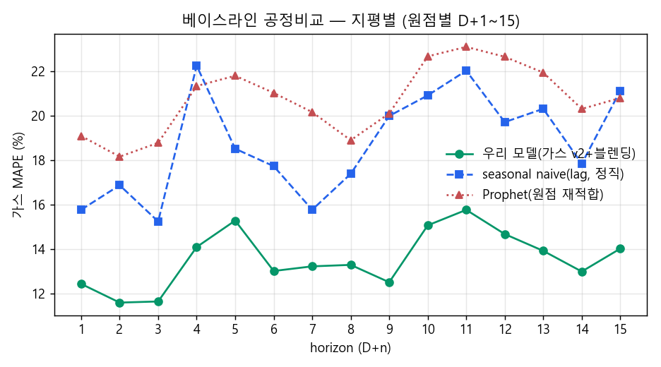
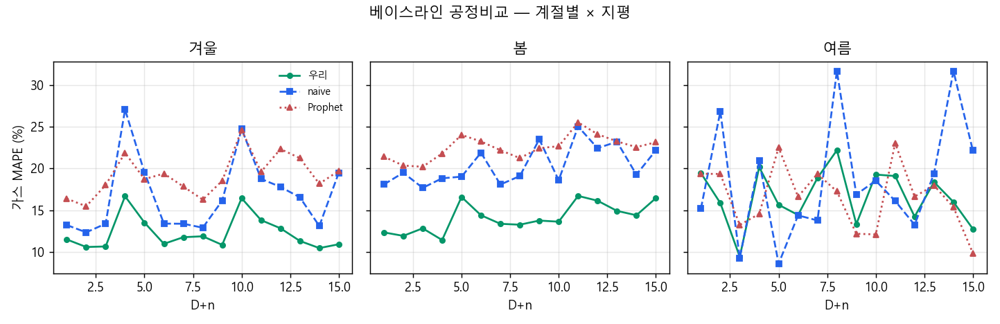

# 7 baseline 리포트 — 발전용 가스수요 Prophet 가벼운 베이스라인

> 상세·그림은 `baseline_prophet.ipynb`. 산출물: `tab/metrics.csv`, `fig/*.png`.
> 데이터: `input_data_land.db` `historical`, 타깃 `gen_gas_kr`(시간단위), **2022-01부터**(G-10).

## 한 줄 결론
외생변수(net_load) 없이 **순수 시간 패턴만**으로 가스 발전을 예측하면 test 2026 MAPE는 **seasonal naive(lag168) 19.0% / Prophet 최선 20.9%** 수준이다.
본 모델(7-A LGBM, test MAPE **11.4%** / R² 0.78)과의 격차가 곧 **net_load(수요+신재생) 정보의 기여분**이며, 베이스라인이 그 하한선을 정량화한다.

## 설정
- univariate. **`add_regressor` 미사용** — net_load를 빼는 것이 이번 베이스라인의 정의(외생변수를 넣으면 베이스라인이 아니라 또 하나의 본 모델이 됨).
- 분할(7-A 동일): **train 2022–24 / val 2025 / test 2026**(1~6월 부분구간 ~3,700행).
- Prophet은 train으로 1회 적합 → 2025–26 전체를 **순수 시간 외삽** 예측. seasonal naive는 1주 전 실측을 참조(정보 조건이 다름, 아래 해석 참조).
- 결측 처리: 2022+ 적재 후 `gen_gas_kr` NaN 14행(test 2026 말미 미수집 등) 제거. 1시간 간격 연속성 점검 통과.

## 결과 (MAPE, %)
| 모델 | val 2025 | test 2026 | R²(test) |
|---|---|---|---|
| **seasonal naive (lag168)** | **18.1** | **19.0** | 0.39 |
| Prophet `add·yr_on·KR휴일` | 23.7 | **20.9** | 0.41 |
| Prophet `mult·yr_on·no휴일` | 22.7 | 20.9 | 0.41 |
| Prophet `add·yr_on·no휴일` | 24.8 | 21.4 | 0.41 |
| Prophet `mult·yr_on·KR휴일` | 21.3 | 22.0 | 0.30 |
| Prophet `mult·yr_off·KR휴일` | 24.9 | 25.4 | 0.24 |
| Prophet `add·yr_off·KR휴일` | 25.7 | 26.0 | 0.24 |
| Prophet `mult·yr_off·no휴일` | 25.7 | 26.0 | 0.22 |
| Prophet `add·yr_off·no휴일` | 26.5 | 26.7 | 0.20 |

전체 지표(MAE·RMSE 포함)는 `tab/metrics.csv`.

## 읽는 법 — 무엇이 효과 있었나
1. **연주기(yearly) 켜는 것이 가장 크다.** yearly on(MAPE ~21%) vs off(~26%)로 약 5%p 차이. "2022~ 데이터가 짧아 연주기가 약할 것"이라는 우려와 달리, 3년치로도 여름·겨울 수준 차이를 잡아 외삽에 분명히 기여했다. → **베이스라인은 yearly on을 기본으로 권장.**
2. **가법 vs 승법**: 차이가 작고 혼재(test에서는 거의 동률). 가스 진폭이 수준에 비례한다는 가설의 이득은 이 구간에선 뚜렷하지 않았다.
3. **한국 공휴일(KR)**: 대체로 소폭 개선(예: `add·yr_on`에서 test 21.4→20.9). 큰 효과는 아니지만 손해는 없음. "순수 시간만"의 경계를 지키려면 휴일 없는 variant를, 약간의 정확도를 원하면 휴일 variant를 쓰면 된다.

## seasonal naive가 Prophet보다 좋은 이유 (해석 주의)
naive(lag168)가 모든 Prophet보다 낮은 MAPE를 보이지만, **둘은 정보 조건이 다르다.**
- naive는 **1주 전 실측**을 그대로 쓴다 → 사실상 1주 지평의 최신 정보 활용.
- Prophet은 2024년 말까지만 보고 **1.5년을 외삽**한다 → 지평이 길어 추세·수준 드리프트에 불리.

즉 naive는 "최근값을 안다"는 강한 정보 하한선, Prophet은 "과거 패턴만으로 외삽"하는 약한 정보 하한선이다. 한 주 확대 그림(`fig/baseline_week_zoom.png`)을 보면 Prophet은 일·주 모양(주간 피크·야간 저점, 주말 약화)을 매끄럽게 재현하지만 진폭이 실측보다 다소 작고, naive는 모양은 1주 전을 그대로 따라가 위상은 맞되 그 주의 사건엔 둔감하다.

### 2026년 봄 집중 (`fig/spring_2026_baseline.png`)
봄(3~5월) 구간만 떼어 보면 Prophet MAPE 23.2% / naive 19.2%로 둘 다 test 평균보다 다소 나쁘다(환절기 수준 변동). 시각별 평균 프로파일(평일) 패널에서 **Prophet이 한낮 피크 진폭을 실측보다 낮게 잡는 진폭 압축**이 음영으로 드러난다 — 외생변수 없는 시간 외삽의 전형적 한계로, net_load를 넣는 본 모델이 메우는 부분이 바로 이 진폭이다.

## 본 모델과의 격차 = net_load의 몫
- 베이스라인 최선 test MAPE ≈ 19~21% → 7-A LGBM **11.4%**. 시간 패턴만으로 설명되지 않는 오차의 약 **절반**을 net_load(수요+신재생) 정보가 메운다.
- R²로도 baseline ~0.4 vs LGBM 0.78로 격차가 분명. 가스 발전이 "달력으로 도는 부하"가 아니라 **그 시각의 잔여수요(net_load)에 끌려가는 부하**임을 베이스라인 대비로 재확인.

## 비고·주의
- test 2026은 1~6월 부분구간이라 연간 대표성이 없다(여름 피크 미포함). 절대 MAPE는 향후 후속 데이터로 갱신 권장.
- Prophet 평가는 train 1회 적합 후 전체 외삽이라 지평이 길수록 불리하게 잡힌다(베이스라인을 의도적으로 보수적으로 둔 셈). 더 공정한 비교가 필요하면 val 포함 재적합 후 test 예측으로 확장 가능.
- 산출 재생성: `python build_baseline_nb.py` → `jupyter nbconvert --to notebook --execute --inplace baseline_prophet.ipynb`.

---

## 공정 지평별·계절별 비교 (보고서용, 2026-06-15)

> 위 표는 평가조건이 서로 달랐다(Prophet=2022-24 1회적합 후 전체외삽 / naive=1주전 실측=D+7 정보 / 본모델=원점별 백테스트).
> 보고서용으로 **셋을 같은 조건**으로 다시 비교: 동일 원점(forecast_horizon base 30개 균등표집)·동일 타깃(원점별 D+1~15)·**원점까지의 정보만**. 산출 `compare_horizon_season.py` → `tab/compare_horizon_season.csv`, `fig/compare_{horizon,season}.png`.

**공정화 처리:**
- **우리 모델** = `est_horizon_land.est_gas_gen_land`(가스 v2 + 보정 + 기후값 블렌딩, 정직 백테스트).
- **seasonal naive(정직)** = 지평별 가용한 최신 주간 lag(D+1\~7=168h·D+8\~14=336h·D+15=504h, 타깃−k≤원점). 구 lag168(미래 참조)을 지평별로 정직화.
- **Prophet(개선)** = ★각 원점까지(최근 540일) **재적합** 후 예측 — 구 "2024년말 1회적합 후 1.5년 외삽"의 빈약함(최근 수준 모름)을 제거한 게 핵심 개선. yearly+weekly+daily, KR공휴일.

### 지평별 가스 MAPE (%)
| 지평 | 우리 모델 | naive(lag) | Prophet | | 지평 | 우리 | naive | Prophet |
|---|---|---|---|---|---|---|---|---|
| D+1 | **12.4** | 15.8 | 19.1 | | D+9 | **12.5** | 20.0 | 20.1 |
| D+2 | **11.6** | 16.9 | 18.2 | | D+10 | **15.1** | 20.9 | 22.7 |
| D+3 | **11.7** | 15.3 | 18.8 | | D+11 | **15.8** | 22.0 | 23.1 |
| D+5 | **15.3** | 18.5 | 21.8 | | D+12 | **14.7** | 19.7 | 22.7 |
| D+7 | **13.2** | 15.8 | 20.2 | | D+15 | **14.0** | 21.1 | 20.8 |
| **전체** | **13.56** | 18.73 | 20.72 | | | | | |

### 계절별 가스 MAPE (%) — 전체 지평 평균
| 계절 | 우리 모델 | naive | Prophet |
|---|---|---|---|
| 겨울 | **12.25** | 16.66 | 19.10 |
| 봄 | **14.13** | 20.41 | 22.56 |
| 여름 | **16.56** | 18.20 | 16.72 |

### 읽는 법
- **우리 모델이 전 지평·전 계절에서 베이스라인을 명확히 상회**(전체 13.6% vs naive 18.7% vs Prophet 20.7%). 격차는 곧 **net_load(수요+신재생) 정보의 기여분** — 가스가 "달력으로 도는 부하"가 아니라 "그 시각 잔여수요에 끌려가는 부하"라는 §본문 결론과 일치.
- **Prophet은 원점 재적합으로 개선했어도 여전히 최약**(전체 20.9→20.7%로 거의 안 변함). 즉 Prophet이 나빴던 본질은 적합 방식이 아니라 **가스가 순수 시간패턴으로 안 도는 변수**라는 점. 재적합은 정직·지평분해를 가능케 했을 뿐, 구조적 한계(외생변수 부재)는 못 메운다.
- **naive > Prophet**: 최신 주간 실측(naive)이 시간 외삽(Prophet)보다 강한 정보 하한선. 단 멀어질수록(D+10+) naive도 22%대로 악화.
- **여름은 셋이 근접**(우리 16.6·Prophet 16.7·naive 18.2): 여름=6월만(표본 적음)이고 한낮 덕커브가 달력성이 강해 Prophet이 따라붙음 — 본모델 우위가 가장 작은 구간. 여름 데이터가 쌓이면 재평가 필요(블렌딩 w 재조정과 동일 맥락).
