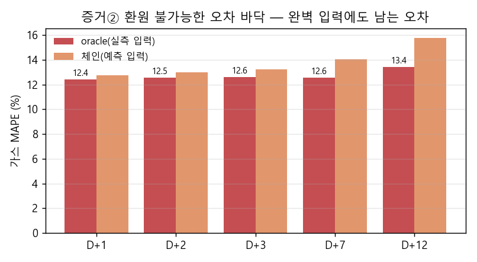
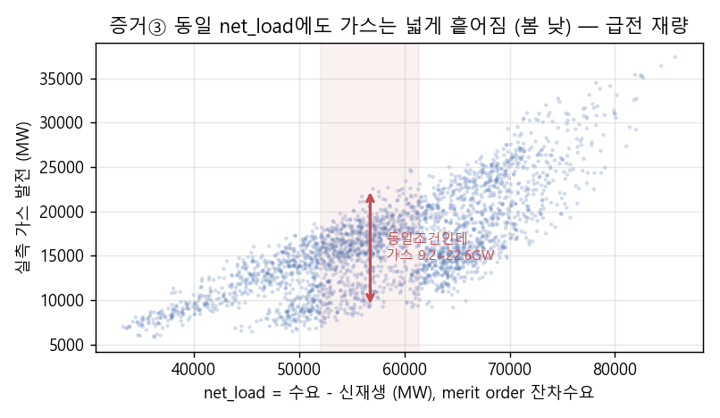

# 7 — 가스 발전량은 완벽 학습이 불가능하다 (급전 재량 = 환원 불가능 오차) 2026-06-15

> 목적: 모델 개선이 아니라 **"정확한 천연가스 발전량 예측은 전력거래소(KPX)의 급전 판단이
> 개입하므로 본질적으로 완벽 학습이 불가능하다"** 는 결론을 정량 증거로 뒷받침한다.
> 산출 코드 = `exp_irreducible.py`, 그림 = `training/fig/irreducible_*.png`.

## 1. 명제와 논리 — 왜 본질적으로 불가능한가
가스는 merit order(급전 순서)의 **한계연료(swing/balancing fuel)** 다. KPX 발전 스택에서
원자력·석탄(저비용 기저) 위, 양수 아래에 끼어 **나머지 잔차를 메우는 자리**다. 항등식:

> 가스 ≈ 수요 − 원자력(must-run) − 석탄(급전) − 신재생 − 수력 − 양수 ± **예비력·제약발전**

즉 **다른 모든 자원의 잔차 + 급전소의 운영 재량이 전부 가스로 흡수**된다. 그 재량은
날씨·수요·달력의 함수가 아니라 *판단*이다:
- 예비력 확보(spinning/non-spinning) — 어떤 가스기를 켜고 끄는지
- 제약발전(constrained-on/off) — 송전제약으로 merit과 무관하게 강제 기동·정지
- 기동 계획(최소 기동·정지시간, 기동비용) · 급전지시 · 주파수 조정
- 원자력·석탄의 정비(계획정전)가 잔차를 가스로 예측 불가하게 떠넘김

이 모든 것이 결정론적 함수가 아니므로, **수요·신재생을 완벽히 알아도** 환원 불가능한 오차가 남는다.

## 2. 증거② — 환원 불가능한 오차 바닥 (oracle 실험)
같은 가스 모델(드라이버 최강 집합 `demand+renew+net_load`+자기회귀)을 **동일한 평가 행**에서
두 가지 입력으로 비교했다. (a) **oracle**: 수요·신재생을 *실측값*으로 넣음(입력 예측오차 = 0).
(b) **체인**: v2 예측값(실서빙)으로 넣음.

| 지평 | oracle(완벽 입력) | 체인(예측 입력) | 입력예측 몫 |
|---|---|---|---|
| D+1 | **12.43%** | 12.77% | +0.33%p |
| D+2 | **12.54%** | 13.01% | +0.47%p |
| D+3 | **12.58%** | 13.23% | +0.64%p |
| D+7 | **12.58%** | 14.04% | +1.46%p |
| D+12 | **13.43%** | 15.76% | +2.32%p |

**해석 (핵심):**
- 수요·신재생을 *완벽히* 알아도 **약 12%의 오차 바닥**이 D+1부터 존재하며 사라지지 않는다.
- 바닥이 **D+1(12.4%) → D+12(13.4%)로 거의 평평**하다. 만약 이 오차가 "예측이 어려워서"라면
  지평이 멀수록 급증해야 하는데 그렇지 않다 → **지평 불확실성이 아니라 구조적 바닥**.
- "입력예측 몫"(체인−oracle)은 D+1 +0.3%p로 미미하고 장지평에서만 +2%p대로 커진다. 즉
  **단기 오차의 대부분은 입력 예측 정확도가 아니라 입력으로 설명되지 않는 영역**이다.
- 봄·여름 낮은 바닥이 더 높다(oracle 봄낮 19.3%·여름낮 19.2%): 신재생 트로프를 가스가 메우는
  시간대라 급전 재량의 비중이 가장 크다.

## 3. 증거③ — 동일조건 분산 (모델과 무관한 하한)
모델을 전혀 쓰지 않고, 관측 가능한 조건 **(계절×시각×요일유형×net_load 3분위)** 로만 묶었다
(2023–2025, 표본 ≥10인 bin, 총 29,361시간·541개 bin). 같은 조건이 여러 가스 값에 대응하므로,
그 관측치만 쓰는 **어떤 예측기의 최선(=조건부 평균)** 도 이 분산은 넘지 못한다.

- **조건부평균 예측기 MAPE 하한 = 13.04%**
- bin 내 평균 변동계수(표준편차/평균) = **15.6%**
- 낮(09–15h) 계절별 하한: 겨울 11.8% · **봄 18.0%** · 여름 14.1%

**구체 예시 (봄·평일·13시·중간 net_load, 75개 표본):**
> net_load 52,016~61,404MW로 **잔차수요가 거의 같은데**,
> 실측 가스는 **9,211~22,561MW**(평균 16,253, ±2,969, CoV 18%)로 흩어진다 — 2.5배 차이.

**해석:** 잔차수요(net_load)·시각·계절·요일이 사실상 동일해도 가스는 2배 넘게 달라진다. 이
세로 분산은 어떤 모델로도 설명할 수 없으며, 그 정체가 바로 §1의 급전 재량(예비력·제약발전·
석탄/원전 정비 등 미관측 의사결정)이다.

## 4. 보강 — 격차를 메울 드라이버가 막혀 있음
이 바닥을 닫으려면 석탄·원전 출력 같은 "merit order 아래쪽" 정보가 필요하지만 전부 막혀 있다:
- **원자력 피처 추가 금지** — covariate shift로 악화 확인(2026-06-06, PROJECT 하드제약).
- **석탄·원전 출력 제외** — 예측 체인은 계량수요+시장신재생만(G-14 market view 확정).
- **설비용량(연료원별)도 불가** — 단조 증가라 test 100% 외삽 = covariate shift. `cap_btmppa`가
  G-18에서 이미 악화로 기각됨. 즉 **merit order를 닫으려는 시도 자체가 실패 경로로 확인**됐다.

## 5. 결론
- 증거②(oracle 바닥 ~12%, 지평 평평)와 증거③(모델 무관 하한 ~13%, CoV 16%)가 **독립적으로
  같은 결론에 수렴**한다: 가스 오차의 대부분은 입력 예측 정확도나 모델 성능이 아니라,
  **관측·학습 불가능한 급전 재량에서 온다.**
- 따라서 **"정확한 가스 발전량은 KPX의 판단이 개입하므로 완벽 학습이 불가능하다"** 는 명제는
  정량적으로 성립한다. v2 모델의 D+1 12.2%는 이 구조적 바닥(~12%)에 이미 근접한 값이며,
  추가 피처·튜닝으로 이 바닥을 넘기는 본질적으로 어렵다.
- 함의: 가스는 점예측 정확도 경쟁보다 **불확실성 구간(예측밴드)·시나리오로 다루는 것이 타당**하다.
