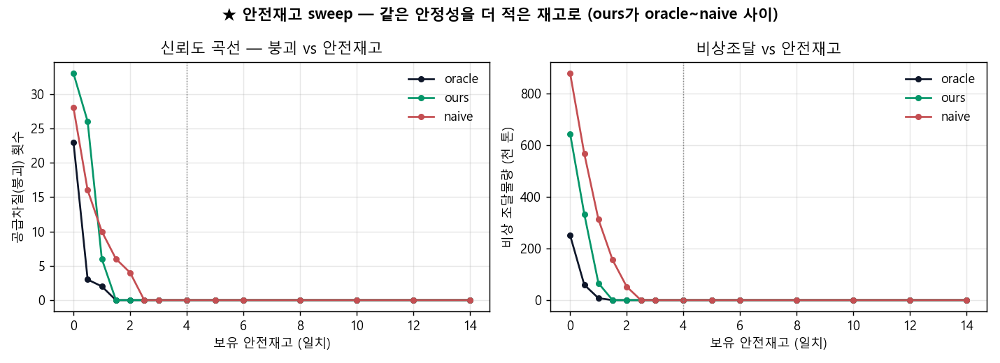
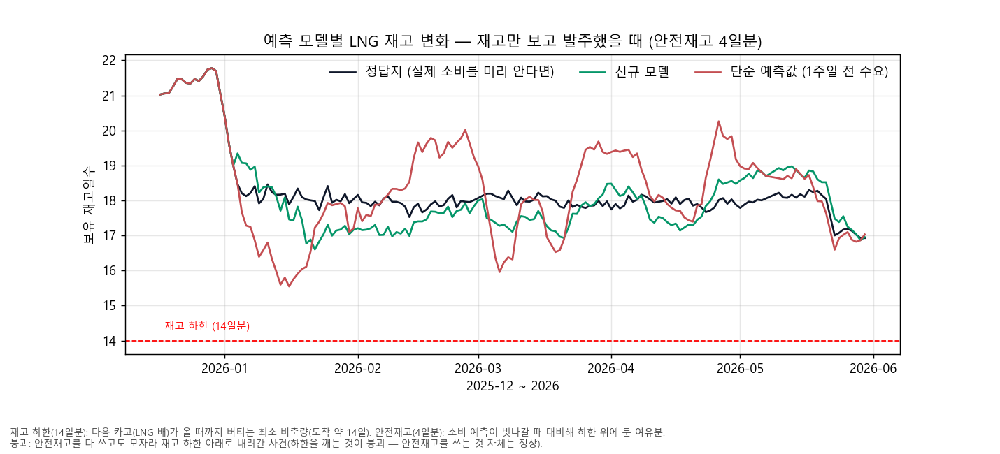

# LNG 조달 시나리오 v4 — 같은 공급 안정성을 더 적은 재고로 (재고/신뢰성 중심) 2026-06-16

> **메시지: 정밀한 수요예보는 같은 공급 안정성(붕괴 0)을 더 적은 안전재고로 달성하고, 같은 재고에선
> 비상 조달을 덜 유발한다.** 가스공사 도입팀의 실제 결정변수는 가격 타이밍이 아니라 **공급 안정성(재고)**
> 이다(발전용 가스는 사실상 의무공급 → "비싸서 안 산다"가 성립 안 함). 그래서 예보 가치를 가격 차익이
> 아니라 **재고 효율·공급 신뢰도**로 측정한다. (우리 모델은 가스 *수요*를 예측하지 *가격*을 예측하지 않는다.)
> 산출 `lng_procurement_sim2.py`.
>
> **v4 변경(이것만 바뀜):** ① 헤드라인 안전재고 3일 → **4일**(아래 a-priori 사유). ② 용어 풀이·붕괴 정의 추가.
> ③ 선택 부록 §5(JKM 종가 사후 환산) 추가. 시뮬레이션 로직·정직성 원칙·수치 산출은 v3 그대로.

## 용어 풀이 (심사위원도 바로 이해하도록 한 줄씩)
- **재고 하한(14일분)**: 공급 안정을 위해 사수하는 최소 비축량. 카고(LNG 배) 도착에 약 14일이 걸리므로, 다음 배가 올 때까지 버티는 양이다.
- **안전재고(4일분)**: 소비 예측이 빗나갈 때를 대비해 하한 *위에* 추가로 두는 여유분(버퍼). 예측이 정확할수록 이 여유분을 적게 둬도 된다.
- **붕괴**: 안전재고(버퍼)를 다 쓰고도 모자라 **재고 하한(14일분) 아래로 내려간 사건.** 이때 부족분을 비상 조달해 하한으로 복구한다. (안전재고를 쓰는 것 자체는 정상 — 하한을 깨는 것이 붕괴.)

## 설정 (가격 없음, days-of-supply)
- 소비 = `historical.gen_gas_kr`(MW)×0.1521 ton/MWh(G-5). 평가창 2025-12~2026-06, **daily_max=103,679 ton**.
- 재고: FLOOR=14일치(공급 하한·비상 트리거)·START=21일치·CAP=30일치. LEAD=14일, 보호구간=15일.
- 모델(소비예보만 다름): oracle(완벽)·ours(`est_horizon_land` D+1~15)·naive(정직한 주간 lag). **지평 D+1~15 전부 가용·기후값 폴백 0건**(결정일 163개, 2025-12-17~2026-05-30).
- 정책(3모델 공통, 가격 무관): base-stock(포지션=보유+운송중), S=FLOOR+안전재고(SS)+예보 LTD(15일). 하한 붕괴 시 부족분 비상 조달·복구(물량만 집계).

## 헤드라인 (SS=4일치, ★a-priori 고정)
> **안전재고 4일은 결과를 보기 전 고른 보수적 기준선이다 — 세 모델 모두 붕괴 0을 보장하는 안전한 운영점.**
> 안전재고를 올리면 세 모델이 같이 안전해질 뿐, 그 자체가 신규 모델을 유리하게 만들지 않는다.

| 모델 | LTD 예보오차 σ(천t) | 붕괴 | 비상물량(천t) | 평균재고(일) | **붕괴0 필요 안전재고(일)** |
|---|---|---|---|---|---|
| oracle | 0 | 0회 | 0 | 18.3 | 1.25 |
| **ours** | **65** | 0회 | 0 | 18.1 | **1.50** |
| naive | 117 | 0회 | 0 | 18.4 | 2.50 |

### ★ 진짜 차별점 (헤드라인 메시지)
1. **더 적은 안전재고로 붕괴 0 도달**: 신규 모델은 **1.5일분** 안전재고로 붕괴 0을 달성, 단순 예측은 **2.5일분**이 필요 — 신규 모델이 **1일분(≈10.4만톤) 적은 안전재고**로 같은 안정성을 확보. (재고이론: 안전재고 = Z·σ, 예측이 정밀할수록 적게 쌓는다.)
2. **정답지 추종**: 재고 궤적에서 신규 모델(초록)이 정답지(검정)를 좁은 폭으로 바짝 따라가고, 단순 예측(빨강)만 15.5~20일치로 크게 출렁인다(부정확성 = 더 큰 재고 변동성).
3. **정량 근거**: LTD(보호구간 누적수요) 예보오차 σ — 신규 모델 65천t vs 단순 예측 117천t(신규가 **약 55%, 즉 45% 더 정밀**).

## ★ 신뢰도 곡선 (안전재고 0~14일 sweep)

- **붕괴 횟수**: 현실 버퍼(**SS≥1일**)에서 신규 모델이 더 빨리 0에 도달(신규 ~1.5일·단순 ~2.5일). 같은 안정성을 더 적은 재고로.
- **비상 조달물량**: 신규 모델이 **전 SS 구간에서 단순 예측보다 적다** — 오차가 작아(σ 낮음) 붕괴해도 부족분이 작다.
- **재고 궤적(@SS=4일)**: 세 모델 모두 붕괴 0(하한 미접촉). 신규(초록)는 정답지(검정)를 바짝 추종해 린하게, 단순(빨강)은 과대·과소 발주로 크게 출렁인다.
- **정직한 미묘함**: SS<1일(버퍼 거의 0, 비현실적 운영)에선 붕괴 *횟수*가 역전(단순 예측의 보수적 과대예측이 우연히 횟수를 줄임). 단 그때도 비상 *물량*은 신규가 적다. → **헤드라인은 현실 버퍼(SS≥1일) 구간으로 한정**해 해석한다.

## (선택) 부록 §5 — 정밀 예보의 금전 가치를 "재고 투자"로 환산
> **사용자 방침: 가격 타이밍은 보지 않는다**(미래 가스가격을 알 수 없으므로). 가격 분기 없는 순수 재고정책의
> 결과를 JKM 종가로 **사후 환산**한 *참고치*다. JKM은 매입 시점 판단에 쓰지 않았다.

- **환산 조건**: JKM **평균 종가 $15.42/MMBtu**(2026-01~06), 환율 **1달러 = 1,500원**, 톤→MMBtu **50 MMBtu/톤**(LNG 업계 근사 환산계수).

### ★ 정밀 예보의 가치 = "더 린한 버퍼에서도 안전 운영"
> 가스공사는 안전재고가 곧 묶이는 자본이라 **최대한 린하게(적게) 운영**하려 한다. 정밀 예보의 값어치는 여기서 나온다 — 같은 안정성을 더 적은 비축으로.

| 안전재고 | 신규(ours) 붕괴 / 비상조달 | 단순(naive) 붕괴 / 비상조달 |
|---|---|---|
| **1.5일** | **0회 / 0** | 6회 / 156천t |
| 2.0일 | 0회 / 0 | 4회 / 52천t |
| 2.5일 | 0회 / 0 | 0회 / 0 |

- **신규는 안전재고 1.5일분만으로 붕괴 0**(린 운영 가능). 같은 1.5일분에서 **단순 예측은 6회 붕괴(비상조달 156천t)** — 같은 버퍼로는 안전하지 못하다. (1.5일은 임의 선택이 아니라 *신규 모델 자신의 붕괴0 경계* = a-priori.)

#### 단순 예측의 딜레마 (둘 중 하나 — 합산하지 않음)
| 선택 | 내용 | 환산 비용 |
|---|---|---|
| **(A) 안전 우선** | 붕괴 0이 되려면 안전재고 2.5일분 필요 → 신규보다 1.0일분(≈10.4만톤) 더 비축 | **약 1,199억원** 운전자본 더 묶임 |
| **(B) 린 운영** | 신규처럼 1.5일분으로 운영 → 비상조달 156천t의 단기조달 할증 발생 | 프리미엄 10/20/30% → **약 138 / 277 / 415억원** |

- **신규 모델은 (A)·(B)를 둘 다 회피한다** — 린한 1.5일분에서도 붕괴 0, 비상조달 0.
- 비상조달 할증은 **발생일 JKM 종가**로 환산(붕괴가 1~2월 저가 구간에 몰려 환산 단가가 기간 평균보다 낮게 잡힘 — 그대로 반영). 프리미엄 %는 단기 spot 조달 할증 *가정*이라 단일값 대신 민감도로 제시한다.
- **부수(@SS=4)**: 넉넉한 4일 버퍼에서도 신규의 평균 보유재고가 0.27일분(≈2.8만톤·약 325억원) 낮다.

> **왜 "총 매입물량·최종재고"로 비교하지 않나 (정직성):** base-stock 정책에선 항등식 **총매입 = 총소비 + (기말 − 기초 재고포지션)**
> 이 성립한다. 소비·기초 재고가 두 모델 동일하므로, 총매입(또는 최종재고) 차이는 *윈도우를 자른 시점에 운송 중인 카고 물량*
> 차이 = **끝점 아티팩트**다. 실제로 5/30 절단 시점엔 단순 예측이 +19만톤 더 산 듯 보이지만, 운송 중 카고가 다 도착하는
> 6/15까지 돌리면 **오히려 신규가 약간 더 사고**(부호가 뒤집힘) 최종 창고재고 차이는 ~0.2일뿐이다. 즉 안전버퍼(SS=4)에선
> 두 모델 다 "태운 만큼 산다." 그래서 가치는 *얼마나 더 샀나*가 아니라 **"같은 안정성을 얼마나 더 린하게 달성했나"**로 측정한다.
- **정직성 단서**: 참고용 단일 시나리오, 미래 가격 미사용. 비상조달·붕괴 정의는 위 용어 풀이와 동일.

## 정직성 가드레일
- 우리 모델은 가스 **수요**를 예측하지 **가격**을 예측하지 않는다 — 그래서 가치를 재고·신뢰성으로 측정.
- 대표 안전재고 4일은 **결과 보기 전 고정**(세 모델 붕괴 0을 보장하는 보수적 기준). 안전재고 상향 자체는 셀링 포인트가 아니며, 신뢰도 곡선이 단일점 의존을 대체한다.
- 단일 5.5개월·단일 시나리오 — 절대값 일반화 금지, **모델 간 상대 비교**가 요지.
- CAP는 소비일수 단순화(실제는 물리 탱크용량). 기후값 폴백 0건. 단순 예측은 "정직한 주간 lag"(일부러 약화한 것 아님).
