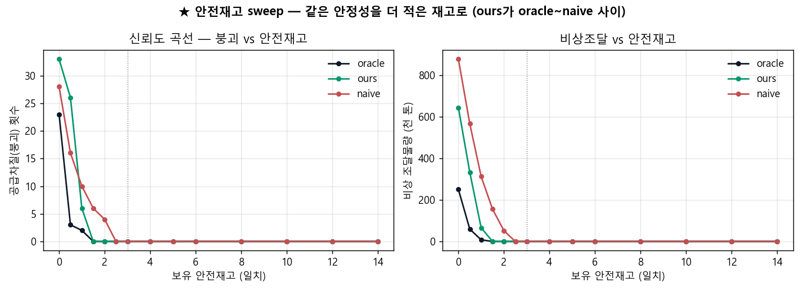
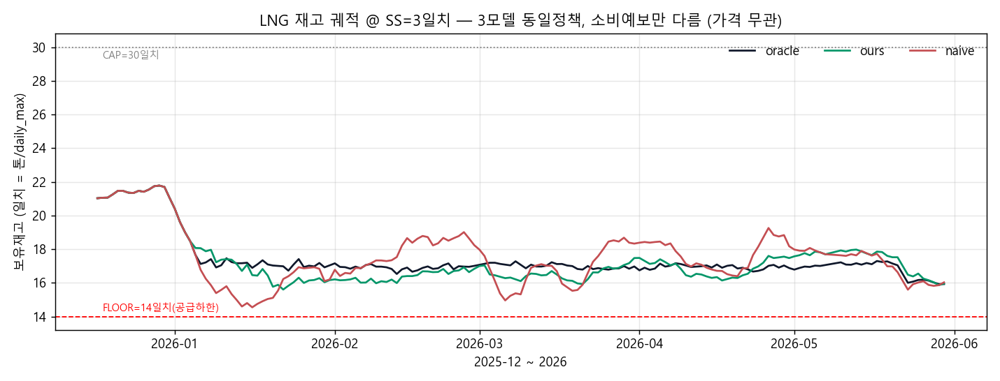

# LNG 조달 시나리오 v3 — 같은 공급 안정성을 더 린하게 (재고/신뢰성 중심) 2026-06-15

> **메시지: 정밀한 수요예보는 같은 공급 안정성(붕괴 0)을 더 적은 안전재고로 달성하고, 같은 재고에선
> 비상 조달을 덜 유발한다.** 가스공사 도입팀의 실제 결정변수는 가격 타이밍이 아니라 **공급 안정성(재고)**
> 이다(발전용 가스는 사실상 의무공급 → "비싸서 안 산다"가 성립 안 함). 그래서 예보 가치를 가격 차익이
> 아니라 **재고 효율·공급 신뢰도**로 측정한다. (우리 모델은 가스 *수요*를 예측하지 *가격*을 예측하지 않는다.)
> 산출 `lng_procurement_sim.py`. v2의 가격($)·JKM 의존 표현만 제거, 수치(σ·붕괴·비상물량)는 동일.

## 설정 (가격 없음, days-of-supply)
- 소비 = `historical.gen_gas_kr`(MW)×0.1521 ton/MWh(G-5). 평가창 2025-12~2026-06, **daily_max=103,679 ton**.
- 재고: FLOOR=14일치(공급 하한·비상 트리거)·START=21일치·CAP=30일치. LEAD=14일, 보호구간=15일.
- 모델(소비예보만 다름): oracle(완벽)·ours(est_horizon_land D+1~15)·naive(정직 주간 lag). **기후값 폴백 0건**(결정일 163개).
- 정책(3모델 공통, 가격 무관): base-stock(포지션=보유+운송중), S=FLOOR+안전재고(SS)+예보 LTD(15일). 하한 붕괴 시 부족분 비상 조달·복구(물량만 집계).

## 헤드라인 (SS=3일치, ★a-priori 고정)
| 모델 | LTD 예보오차 σ(천t) | 붕괴 | 비상물량(천t) | 평균재고(일) | **붕괴0 필요 안전재고(일)** |
|---|---|---|---|---|---|
| oracle | 0 | 0회 | 0 | 17.4 | 1.25 |
| **ours** | **65** | 0회 | 0 | 17.2 | **1.50** |
| naive | 117 | 0회 | 0 | 17.5 | 2.50 |

- **핵심: 같은 붕괴-0 안정성을 ours는 1.5일치 안전재고로, naive는 2.5일치로 — ours가 1일치(≈10.4만톤) 적은 재고로 달성.** LTD 예보오차 σ는 ours 65k vs naive 117k(ours가 **naive의 약 55%**, 45% 더 정밀).
- SS=3일은 셋 다 붕괴 0(충분히 안전한 운영점) — 그래서 헤드라인의 차이는 "붕괴0 필요 안전재고"에서 드러난다.

## ★ 신뢰도 곡선 (안전재고 0~14일 sweep)

- **붕괴 횟수**: 현실 버퍼(**SS≥1일**)에서 ours가 더 빨리 0에 도달(ours ~1.5일·naive ~2.5일). 같은 안정성을 더 적은 재고로.
- **비상 조달물량**: ours가 **전 SS 구간에서 naive보다 적다** — 오차가 작아(σ 낮음) 붕괴해도 부족분이 작다.
- **재고 궤적(@SS=3일)**: ours(초록)는 oracle(검정)을 바짝 추종해 ~16–17일치로 린하게, naive(빨강)는 과대·과소 발주로 15~19일치를 크게 출렁(부정확성 = 더 큰 재고 변동성).
- **정직한 미묘함**: SS<1일(버퍼 거의 0, 비현실적 운영)에선 붕괴 *횟수*가 역전(naive의 보수적 과대예측이 우연히 횟수를 줄임). 단 그때도 비상 *물량*은 ours가 적다. → **헤드라인은 현실 버퍼(SS≥1일) 구간으로 한정**해 해석한다.

## 정직성 가드레일
- 우리 모델은 가스 **수요**를 예측하지 **가격**을 예측하지 않는다 — 그래서 가치를 재고·신뢰성으로 측정.
- 대표 SS=3일치는 결과 보기 전 고정(신뢰도 곡선이 단일점 의존을 대체). 수치는 v2와 동일(가격 표현만 제거, 재선택 없음).
- 단일 5.5개월·단일 시나리오 — 절대값 일반화 금지, **모델 간 상대 비교**가 요지.
- CAP는 소비일수 단순화(실제는 물리 탱크용량). 기후값 폴백 0건. naive는 "정직한 주간 lag"(일부러 약화한 것 아님).
