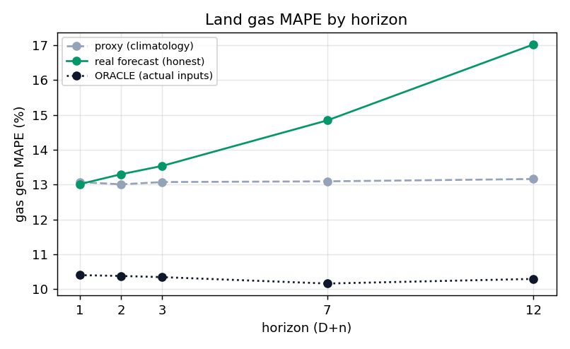

# Phase 1 — 정직한 지평별 진단 (실예보 vs 기후값 프록시 vs ORACLE)

> 산출: `build_horizon_backtest.py`(→`horizon_backtest.parquet`, 181 base·21,358행),
> `diagnose_horizon.py`(→`tab/diag_by_horizon.csv`, `fig/diag_gas_by_horizon.png`).
> 대상: 전국 5(수요)→6(신재생)→7(가스) 체인. 구간 2025-12-16 ~ 2026-06-25(forecast_horizon 보유 범위).

## 1. 왜 다시 쟀나

기존 지평별 검증(7-A2-A, G-14)이 쓴 `chained_gas_dataset.parquet`는 과거 구간에 forecast가 없어
**기상 입력이 사실상 전부 (월,시) 기후값 프록시**였다. 그래서 거기서 나온 결론 — "지평 평평
(D+1 13.08% ≈ D+12 13.16%)", "가스 ~13%", "예보입력 재학습(A안) 무효" — 이 전부 프록시 위에서
도출됐다.

사용자가 구축한 `forecast_horizon`(육지 181 base·D+1~12, 12 UTC 발표)은 **실제 지평별 예보**다.
이걸로 같은 체인을 돌려 처음으로 정직하게 다시 쟀다.

**하드 규칙(사용자 지시)**: 예보가 진짜 없는 시각은 **기후값으로 채우지 않고 평가에서 제외**.
허용 보정은 forecast 앵커 사이 시간 보간(≤4h, 외삽 금지)까지뿐(D+7~12의 3h 해상도는 이 보간으로
1h 복원 — 기후값 아님). 모델은 전부 현행 그대로(재학습 없음, 정직 측정만).

## 2. 결과 (지평별)

| 지평 | 수요 MAPE | 수요 bias | 신재생 nMAE | net_load nMAE | **가스 MAPE(실예보)** | 가스 bias | 가스 MAPE(프록시) | 가스 MAPE(ORACLE) |
|---|---|---|---|---|---|---|---|---|
| D+1  | 3.55% | +1.3% | 15.8% | 6.96% | **13.02%** | +4.0% | 13.08% | 10.41% |
| D+2  | 3.98% | +1.8% | 16.8% | 6.93% | **13.30%** | +4.8% | 13.01% | 10.38% |
| D+3  | 4.22% | +2.0% | 18.1% | 7.11% | **13.54%** | +5.1% | 13.08% | 10.35% |
| D+7  | 5.13% | +2.6% | 30.5% | 6.82% | **14.85%** | +6.0% | 13.10% | 10.16% |
| D+12 | 6.49% | +3.4% | 39.8% | 7.52% | **17.03%** | +7.6% | 13.16% | 10.30% |

(ORACLE = 실측 입력 real_demand_land·renew_gen_total_kr를 같은 7-A2 모델에 넣은 상한.
프록시 = `chained_gas_dataset.parquet`의 test(2026)에 같은 모델·보정 적용.)

## 3. 핵심 발견

1. **"지평 평평"은 기후값 프록시의 허상이었다.** 실예보로 보면 가스 MAPE가 지평에 따라 정직하게
   상승한다(13.0% → 17.0%). 프록시는 D+1만 우연히 맞고(13.08%≈13.02%) 먼 지평의 악화를 통째로
   가렸다. 모든 지평에서 같은 (월,시) 기후값을 쓰니 입력 품질이 지평과 무관해진 탓이다.

2. **ORACLE 바닥 ~10.3%(평평).** 입력이 완벽해도 가스 모델 자체 오차가 ~10.3% 남는다(소규모
   급전·설비 계단의 본질적 한계, 7-A2/7-B 결론과 일관). 이게 줄일 수 없는 바닥선이다.

3. **남는 오차 = 예보 입력 품질.** 실예보−ORACLE 격차가 D+1 +2.6%p → D+12 +6.7%p로 벌어진다.
   이 격차는 수요·신재생 **예보가 멀수록 나빠지는** 데서 온다(수요 MAPE 3.6%→6.5%, 신재생 nMAE
   15.8%→39.8%). 가스 모델을 바꿔 줄일 수 있는 게 아니다.

4. **수요가 체계적으로 양(+)bias.** 실예보를 넣으면 수요가 +1.3~3.4% 과대예측된다(프록시에선
   −0.3%였다 — 부호가 뒤집힘). 이게 가스로 전파돼 가스도 +4.0~7.6% 과대. **현행 보정 ×0.96509는
   부족**하고, 게다가 **bias가 지평에 따라 커지므로 단일 계수로는 못 잡는다.** → Phase 2.

5. 신재생 nMAE는 멀수록 크게 악화(15.8%→39.8%)하지만 가스에 미치는 영향은 제한적이다(net_load
   nMAE가 6.8~7.5%로 거의 평평 — 신재생이 net_load에서 작은 몫, 7-A 중요도 분석과 일관).

## 4. 재학습 ROI 판단 (Phase 4 게이트 입력)

- **가스(7) 재학습은 이득 없음(실예보로 재확인).** 격차의 정체가 입력 품질이지 가스 모델 학습이
  아니므로, 7단계를 예보입력으로 재학습해도 못 줄인다. G-14의 A안 기각이 **프록시가 아닌 실예보
  에서도** 성립함을 확인했다.
- **확실한 이득 = bias 보정 재적합(Phase 2).** 수요·가스의 체계적 양bias는 보정으로 제거 가능.
  bias가 지평 의존적이므로 **지평별(또는 근/원 2구간) 보정**이 단일 계수보다 낫다. 지평 태깅
  서빙(Phase 3 `est_horizon_land`)이 이를 가능케 한다.
- **수요·신재생(5·6) 예보입력 재학습은 ROI 제한적.** 수요 양bias의 큰 부분은 보정으로 잡히고,
  남는 건 예보 변동성(비가역)이다. 재학습은 180일·계절 편중(겨울→초여름)이라 외삽 위험까지 있다.
  → **현 시점 권고: Phase 2 보정으로 먼저 회수하고, 재학습은 보류**(필요 시 이력이 1년 쌓인 뒤
  사용자 확정 하에 재검토). 최종 결정은 Phase 4 게이트.

## 4b. 계절 × 낮시간 분해 (사용자 우선순위 — `diagnose_segments.py`)

사용자 우선순위: ① 계절성(봄·가을 전이철) ② 태양광 낮(09–15h) 반드시 캐치(비대칭 허용).
단 land는 제주식 비대칭이 역효과(낮 과대) → 오차 **부호**를 먼저 측정.

**실예보 가스 MAPE(계절×낮/밤):** 겨울 낮 20.0%(+8.0%)·봄 낮 **24.5%(+9.8%)**·여름 낮 17.8%(+12.1%)
vs 밤 10~14%. **낮이 밤의 2~2.5배·전부 과대(+).** 봄 낮 최악(전이철 확인).
낮 지평별: 가스 bias +6.2%(D+1)→+13.5%(D+12), net_load bias −15%→−11%(낮 net_load 과소=태양광 과대 +5.8% 탓).

**ORACLE(실측입력, 전 계절) 가스 낮 MAPE:** 가을 9.3%·겨울 7.1%·봄 7.8%·여름 6.9%(bias −2~−4.5%).
→ **입력 완벽하면 낮 가스는 멀쩡(7~9%, 약한 과소).** 낮 20~24% 폭발의 주범 = **태양광 낮 예보오차**가
net_load·가스로 증폭(작은 낮 분모로 MAPE 확대). 가스 모델 자체는 perfect-input에선 견고(가을이 모델측 약점).

**비대칭 설계 방향(★ land 부호 확정):** land는 낮에 **과대(+)** → 비대칭은 **낮 과대를 눌러야** 함
(제주는 낮 과소라 반대 — 복붙 금지). 헤드룸 우선순위: ① 태양광 낮 예보(6단계) ② 가스 낮 강건성
(지평별+낮 과대 페널티) ③ 봄·가을 보강. 산출 `tab/seg_*.csv`.

## 5. 한계·메모

- 평가 구간이 forecast_horizon 보유 범위(겨울~초여름 6개월)뿐 — 여름/가을 미포함.
- forecast_horizon엔 day_type이 없어 공휴일은 요일 기반 폴백(미플래그). 영향은 작음(5-A2에서
  lag_dt 실험이 미미했던 것과 일관).
- 수요는 5-A2 지평별 모델(D{n})로 평가(기존 7-A2-A 체인과 apples-to-apples). 운영 5-B 서빙은
  풀드 `lgbm_land_demand_direct.txt`를 쓰므로 절대 수치는 ~0.05~0.1%p 다를 수 있음.
